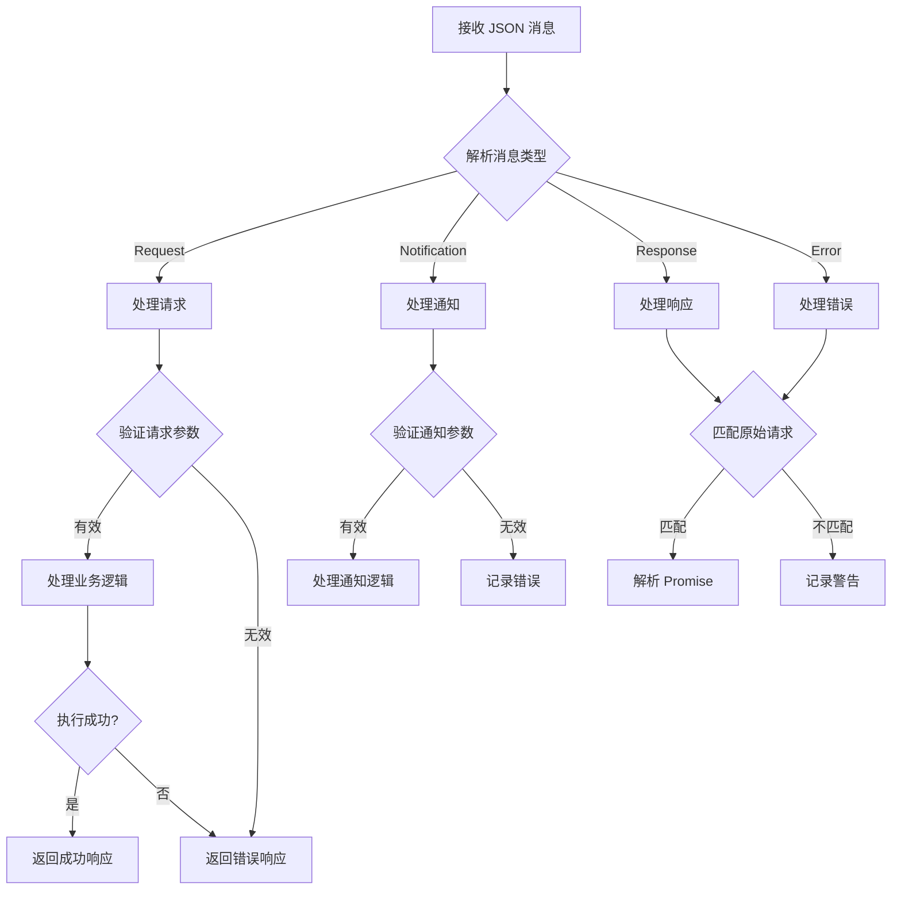
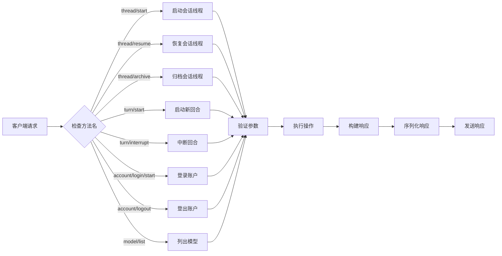
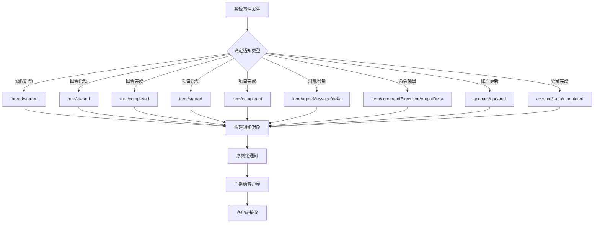
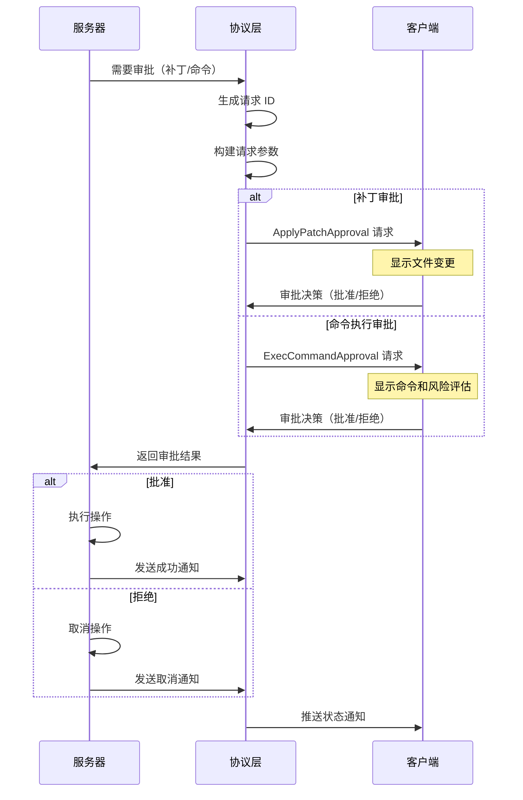
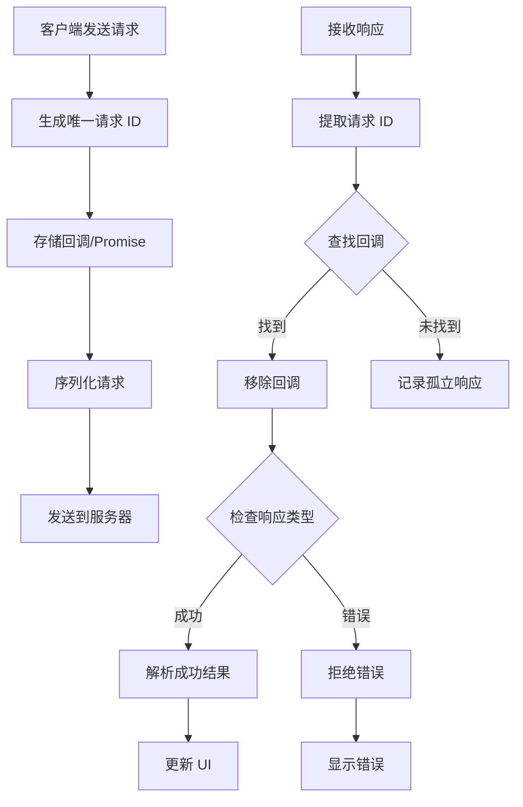
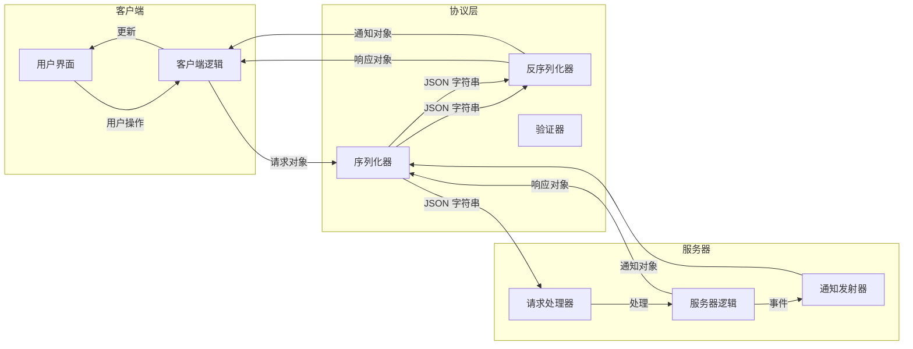
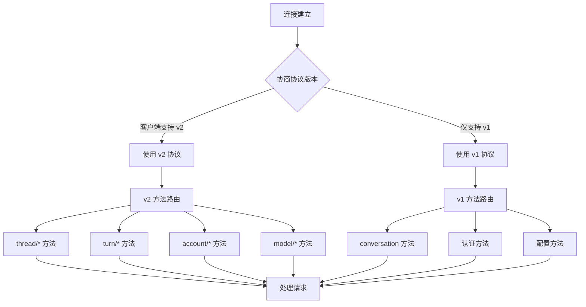
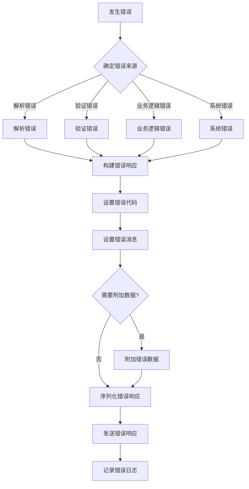

# app-server-protocol 流程图

## 概述

`app-server-protocol` crate 定义了客户端与服务器之间的 JSON-RPC 通信协议。它支持协议的版本 v1（已废弃）和 v2（当前版本）。

## 1. JSON-RPC 消息处理流程

## 2. 客户端请求类型处理流程

## 3. 服务器通知推送流程

## 4. 服务器请求客户端审批流程

## 5. 请求/响应匹配流程

## 6. 数据流图

## 7. 协议版本切换流程

## 8. 错误处理流程

## 关键决策点

1. **消息类型识别**：根据 JSON 字段确定是请求、通知、响应还是错误
2. **方法路由**：根据 `method` 字段路由到相应的处理器
3. **参数验证**：使用 JSON Schema 验证参数结构
4. **请求 ID 匹配**：使用请求 ID 匹配请求和响应
5. **审批决策**：客户端用户决定是否批准服务器的操作请求
6. **协议版本选择**：根据客户端能力选择使用 v1 或 v2 协议

## 类型系统关系

该 crate 使用 Rust 的类型系统和宏来定义协议：

- `JSONRPCMessage` - 所有消息的顶层枚举
- `ClientRequest` - 客户端发起的请求（使用 `client_request_definitions!` 宏生成）
- `ServerRequest` - 服务器发起的请求（使用 `server_request_definitions!` 宏生成）
- `ServerNotification` - 服务器推送的通知（使用 `server_notification_definitions!` 宏生成）
- `ClientNotification` - 客户端推送的通知（使用 `client_notification_definitions!` 宏生成）

所有类型都支持序列化/反序列化（Serde）、JSON Schema 生成（Schemars）和 TypeScript 类型导出（ts-rs）。
