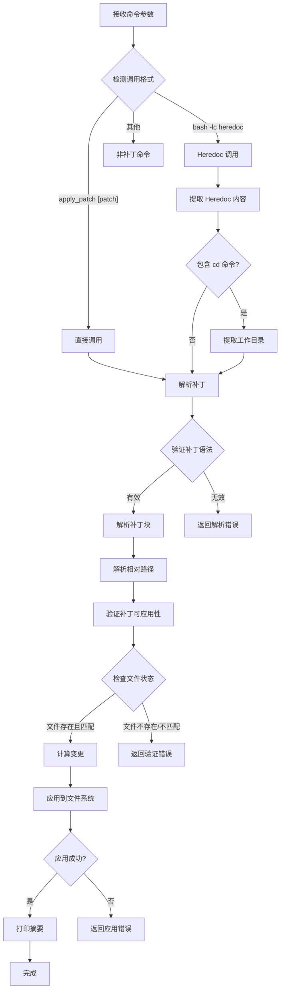
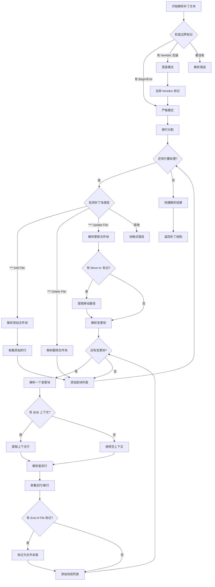
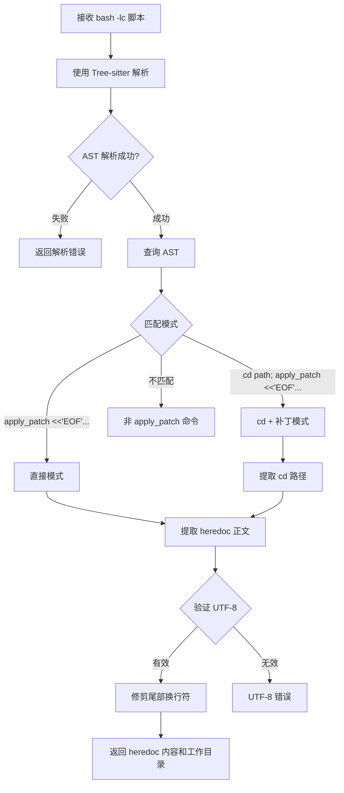
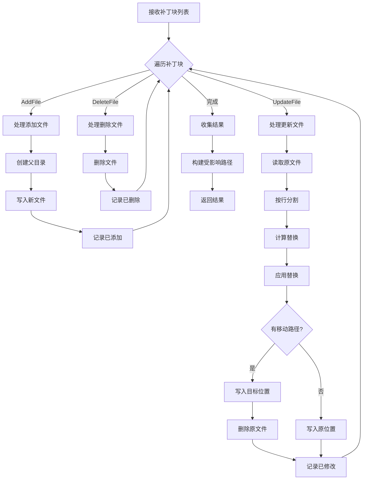
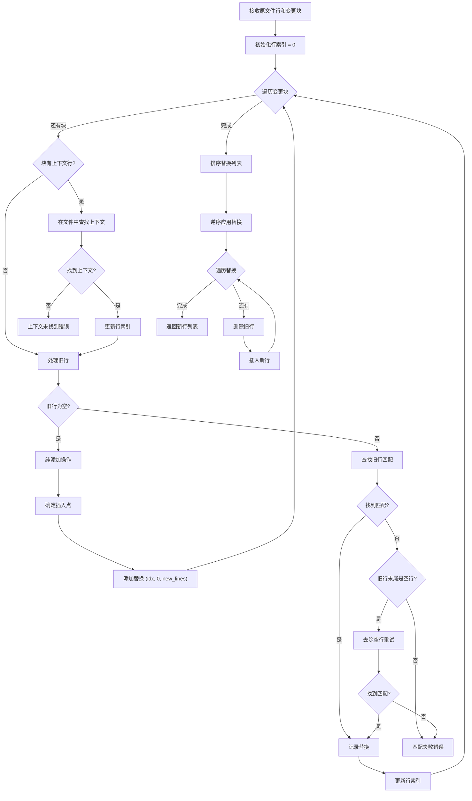
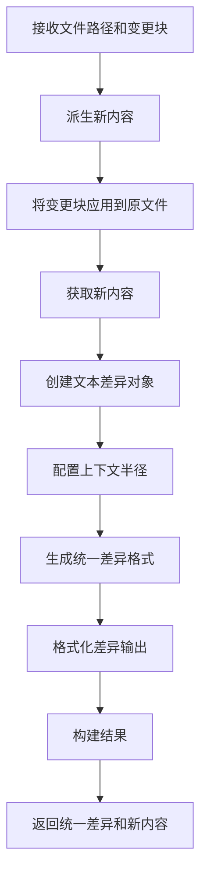
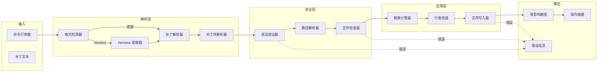
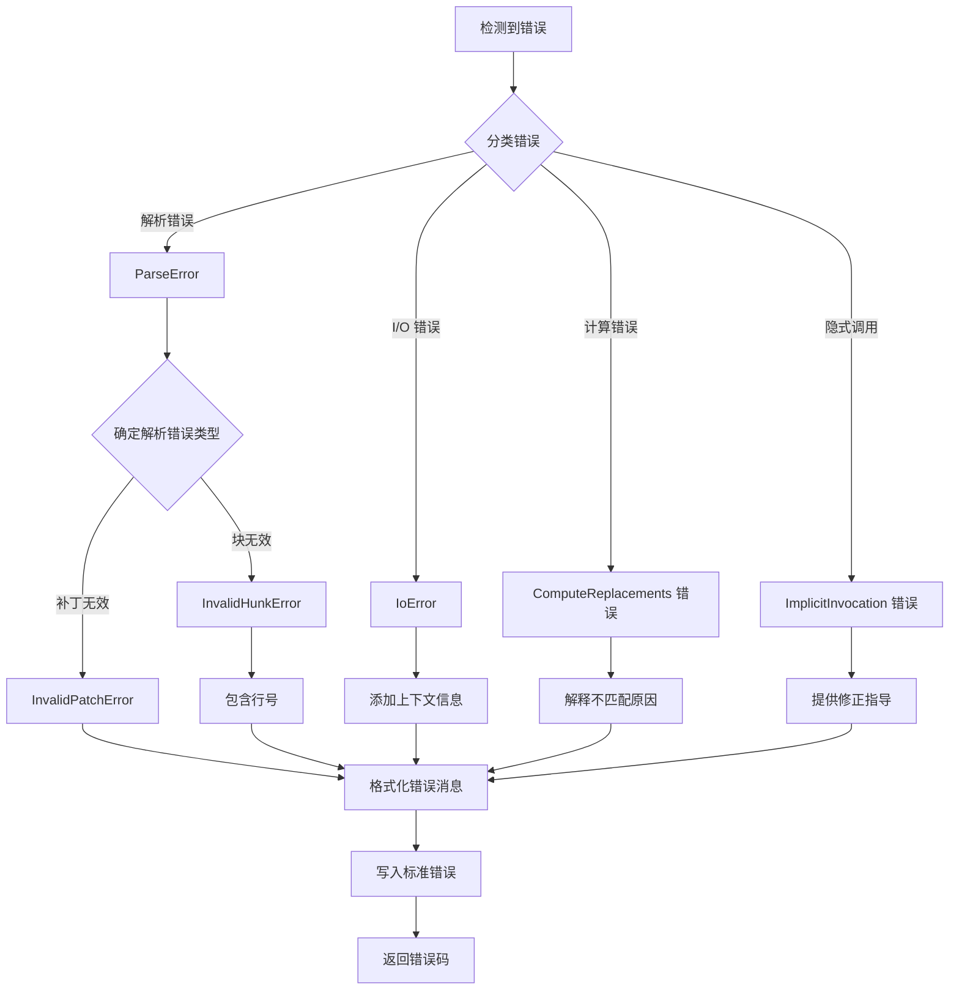
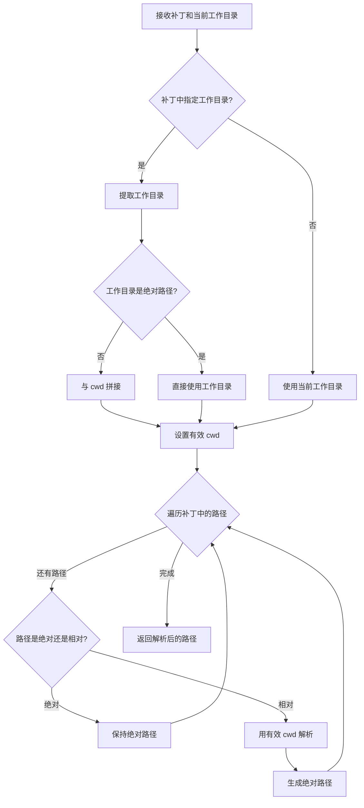

# apply-patch 流程图

## 概述

`apply-patch` crate 实现了一个自定义的补丁格式解析器和应用器。它支持添加、删除和更新文件，并能处理直接调用和 bash heredoc 包装的补丁。

## 1. 补丁应用主流程

## 2. 补丁解析流程

## 3. Bash Heredoc 提取流程

## 4. 补丁应用到文件系统流程

## 5. 变更块匹配和应用流程

## 6. 统一差异生成流程

## 7. 数据流图

## 8. 错误处理流程

## 9. 相对路径解析流程

## 关键决策点

1. **调用格式检测**：判断是直接调用、bash heredoc 还是其他命令
2. **工作目录确定**：从 heredoc 的 `cd` 命令或当前目录获取
3. **补丁语法验证**：检查 Begin/End 标记、块标记格式
4. **文件存在性检查**：对于更新和删除，文件必须存在；对于添加，文件不应存在
5. **上下文行匹配**：使用 `seek_sequence` 查找上下文行的位置
6. **旧行匹配**：精确匹配旧行内容，支持模糊匹配 Unicode 标点符号
7. **替换顺序**：必须逆序应用替换以避免索引偏移
8. **文件末尾处理**：特殊处理标记为 EOF 的块

## 特殊处理

### Unicode 标点符号模糊匹配

为了提高兼容性，查找器支持将某些 Unicode 标点符号（如 EN DASH、NON-BREAKING HYPHEN）与 ASCII 对应字符匹配。

### Heredoc 验证

使用 Tree-sitter Bash 解析器严格验证 heredoc 语法，仅接受以下模式：
- `apply_patch <<'EOF'\n...\nEOF`
- `cd <path> && apply_patch <<'EOF'\n...\nEOF`

### 移动操作

`Move to:` 标记支持在应用补丁的同时移动文件到新位置。
