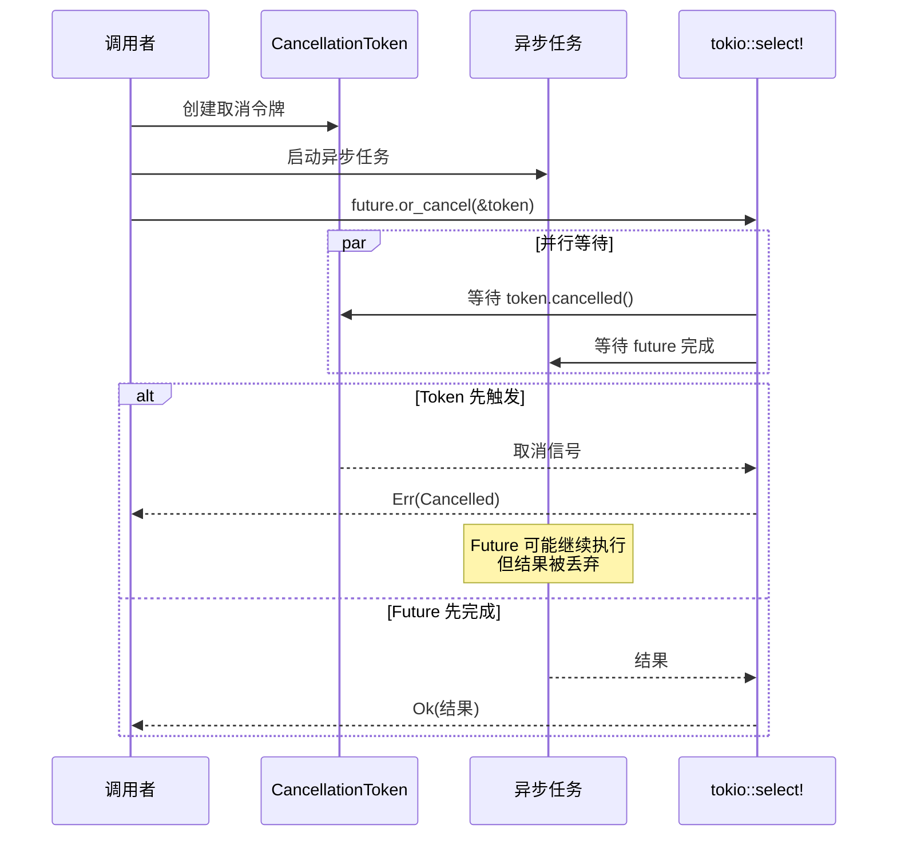
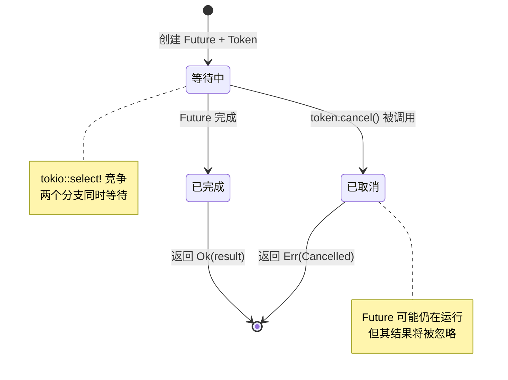
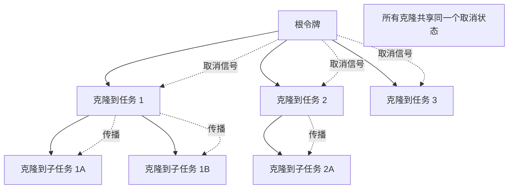

# async-utils 流程图

## 概述

`async-utils` crate 提供了异步编程的实用工具，主要功能是扩展 Future，使其支持取消令牌（CancellationToken）机制。这允许优雅地取消长时间运行的异步操作。

## 1. or_cancel 扩展方法流程

```mermaid
flowchart TD
    Start[调用 future.or_cancel(&token)] --> SetupSelect[设置 tokio::select!]

    SetupSelect --> RaceCondition{竞争条件}

    RaceCondition -->|取消令牌触发| CancelBranch[取消分支执行]
    RaceCondition -->|Future 完成| FutureBranch[Future 分支执行]

    CancelBranch --> ReturnCancelErr[返回 Err(CancelErr::Cancelled)]
    FutureBranch --> WrapResult[包装 Future 结果]
    WrapResult --> ReturnOk[返回 Ok(future_output)]

    ReturnCancelErr --> End[结束]
    ReturnOk --> End
```

## 2. 取消机制原理



## 3. 典型使用场景流程

```mermaid
flowchart TD
    Start[开始异步操作] --> CreateToken[创建 CancellationToken]
    CreateToken --> CloneToken[克隆令牌给子任务]

    CloneToken --> SpawnTask[启动异步任务]
    SpawnTask --> WrapWithOrCancel[使用 or_cancel 包装]

    WrapWithOrCancel --> Execute[执行异步操作]

    Execute --> UserInteraction{用户取消操作?}
    UserInteraction -->|是| CallCancel[调用 token.cancel()]
    UserInteraction -->|否| WaitCompletion[等待任务完成]

    CallCancel --> PropagateCancel[传播取消信号]
    PropagateCancel --> TaskReceives[任务接收取消]
    TaskReceives --> ReturnCancelled[返回 Cancelled 错误]

    WaitCompletion --> ReturnResult[返回任务结果]

    ReturnCancelled --> Cleanup[清理资源]
    ReturnResult --> Cleanup
    Cleanup --> End[结束]
```

## 4. 多任务取消协调流程

```mermaid
flowchart TD
    Start[主任务] --> CreateParentToken[创建父级令牌]
    CreateParentToken --> SpawnMultiple[启动多个子任务]

    SpawnMultiple --> Task1[子任务 1<br/>token.clone()]
    SpawnMultiple --> Task2[子任务 2<br/>token.clone()]
    SpawnMultiple --> Task3[子任务 3<br/>token.clone()]

    Task1 --> Wrap1[or_cancel 包装]
    Task2 --> Wrap2[or_cancel 包装]
    Task3 --> Wrap3[or_cancel 包装]

    Wrap1 --> Execute1[执行任务 1]
    Wrap2 --> Execute2[执行任务 2]
    Wrap3 --> Execute3[执行任务 3]

    Execute1 & Execute2 & Execute3 --> CancelTrigger{父级令牌取消?}

    CancelTrigger -->|是| CancelAll[所有子任务收到取消信号]
    CancelTrigger -->|否| WaitAll[等待所有任务完成]

    CancelAll --> AllCancelled[所有任务返回 Cancelled]
    WaitAll --> AllCompleted[所有任务返回结果]

    AllCancelled --> End[结束]
    AllCompleted --> End
```

## 5. 数据流图

```mermaid
flowchart LR
    subgraph UserCode[用户代码]
        AsyncFn[异步函数]
        CancelHandler[取消处理器]
    end

    subgraph AsyncUtils[async-utils]
        OrCancelExt[OrCancelExt Trait]
    end

    subgraph Tokio[Tokio 运行时]
        Select[tokio::select!]
        Token[CancellationToken]
    end

    AsyncFn -->|.or_cancel(&token)| OrCancelExt
    OrCancelExt -->|实现| Select
    CancelHandler -->|.cancel()| Token
    Token -->|cancelled()| Select
    Select -->|Result| AsyncFn
```

## 6. 状态转换图



## 7. 错误处理流程

```mermaid
flowchart TD
    Start[调用 or_cancel] --> Await[等待结果]

    Await --> CheckResult{检查结果}
    CheckResult -->|Ok(value)| HandleSuccess[处理成功]
    CheckResult -->|Err(CancelErr::Cancelled)| HandleCancel[处理取消]

    HandleSuccess --> ReturnValue[返回值]
    HandleCancel --> LogCancel[记录取消]
    HandleCancel --> Cleanup[清理资源]

    Cleanup --> PropagateError[传播取消错误]
    PropagateError --> ReturnError[返回错误给调用者]

    ReturnValue --> End[结束]
    ReturnError --> End
```

## 8. 令牌传播模式



## 关键决策点

1. **竞争条件处理**：使用 `tokio::select!` 宏同时等待取消和 Future 完成
2. **取消信号传播**：克隆的令牌共享取消状态，调用任何一个的 `cancel()` 都会影响所有克隆
3. **Future 生命周期**：取消不会强制停止 Future，只是忽略其结果
4. **错误类型设计**：简单的 `CancelErr::Cancelled` 枚举，便于模式匹配

## 设计原则

### 1. 非侵入性

- Future 不需要特殊修改即可支持取消
- 使用扩展 trait 提供取消能力

### 2. 组合性

- 可以嵌套使用 `or_cancel`
- 支持任务树的取消传播

### 3. 类型安全

- 使用 Rust 的类型系统确保正确使用
- `async_trait` 宏处理异步 trait 的复杂性

## 使用示例模式

### 模式 1：长时间运行的操作

```rust
async fn long_operation(token: &CancellationToken) -> Result<T, CancelErr> {
    expensive_computation()
        .or_cancel(token)
        .await
}
```

### 模式 2：超时 + 取消

```rust
tokio::select! {
    result = operation().or_cancel(&token) => result,
    _ = tokio::time::sleep(timeout) => Err(TimeoutError),
}
```

### 模式 3：多任务取消

```rust
let token = CancellationToken::new();
let tasks: Vec<_> = (0..n)
    .map(|i| tokio::spawn(work(i).or_cancel(&token.clone())))
    .collect();

// 取消所有任务
token.cancel();
```

## 性能考虑

1. **零成本抽象**：`or_cancel` 是零成本包装，不增加运行时开销
2. **内存效率**：`CancellationToken` 使用 `Arc` 内部共享状态
3. **检查频率**：取消检查只在 `select!` 轮询时发生，不会持续轮询
