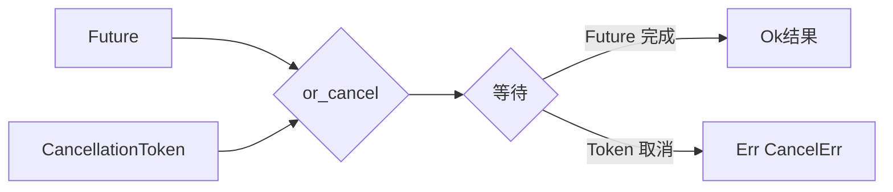

# async-utils

## 文件在整体的作用

`codex-async-utils` 提供异步编程的通用工具，主要提供可取消的 Future 扩展功能。它允许长时间运行的异步操作能够被优雅地取消。

## 主要结构体

### `CancelErr`
```rust
#[derive(Debug, Clone, Copy, PartialEq, Eq)]
pub struct CancelErr;
```
- 取消错误类型
- 当操作被取消时返回

## 主要 Trait

### `OrCancelExt`
```rust
pub trait OrCancelExt: Future {
    fn or_cancel(
        self,
        token: &CancellationToken,
    ) -> impl Future<Output = Result<Self::Output, CancelErr>>;
}
```
- 为任何 Future 添加取消功能
- 使用 `tokio_util::sync::CancellationToken`

## 主要方法

### `or_cancel(self, token: &CancellationToken)`
- 将 Future 与取消令牌组合
- 当令牌被触发时，Future 提前完成并返回 `Err(CancelErr)`

## 使用示例

```rust
use codex_async_utils::OrCancelExt;
use tokio_util::sync::CancellationToken;

async fn long_operation() -> String {
    // 长时间运行的操作
    tokio::time::sleep(Duration::from_secs(60)).await;
    "完成".to_string()
}

let cancel_token = CancellationToken::new();
let task = long_operation().or_cancel(&cancel_token);

// 在另一个任务中取消
cancel_token.cancel();

// task 将返回 Err(CancelErr)
```

## 工作原理



## 依赖关系

- `tokio-util`: CancellationToken 实现
- 标准库 `Future` trait

## 在项目中的位置

```
┌────────────────────────┐
│  codex-core           │
│  (长运行异步操作)      │
└──────────┬─────────────┘
           │
┌──────────▼─────────────┐
│  async-utils           │ ← 此 crate
│  (可取消扩展)          │
└────────────────────────┘
```

## 典型应用场景

- AI 模型流式请求（用户可中断）
- 长时间文件搜索（用户可取消）
- MCP 服务器连接（超时或手动中止）
- 工具执行（用户中止轮次）
