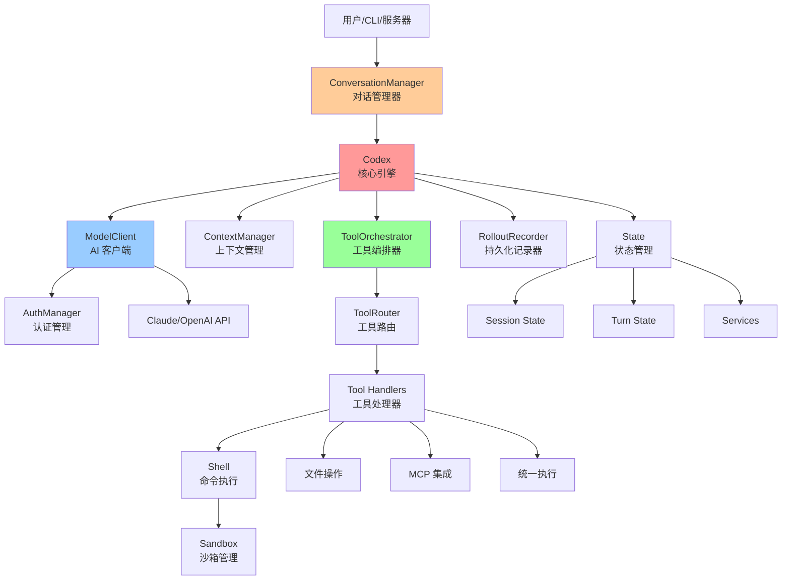
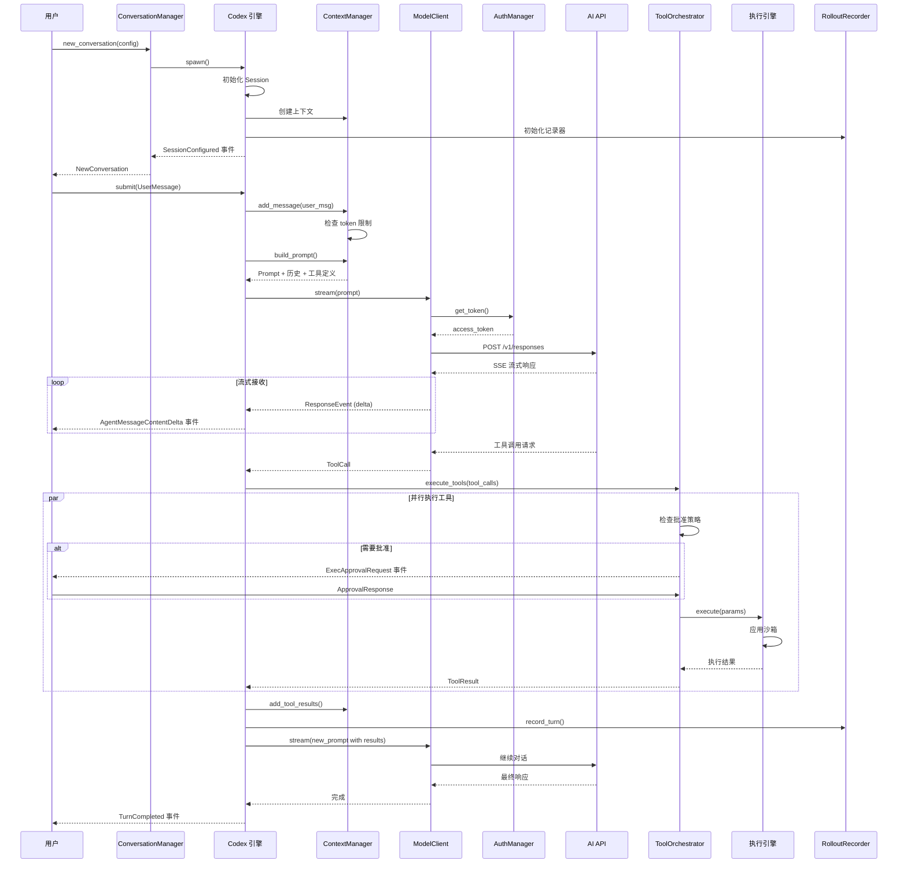
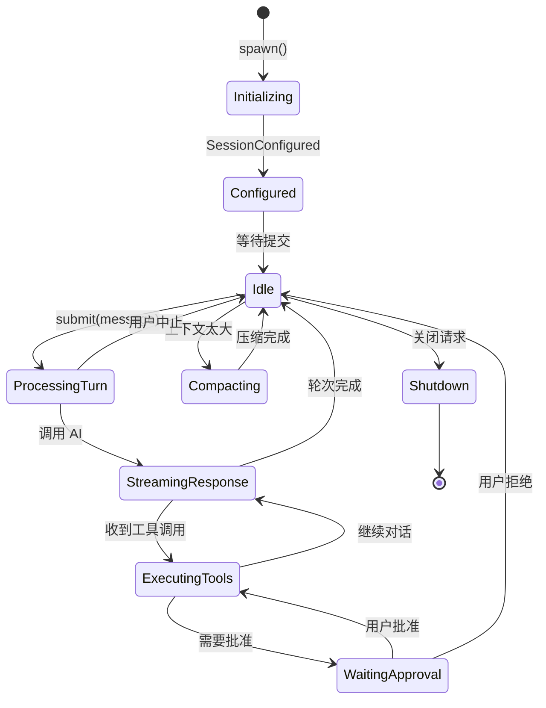
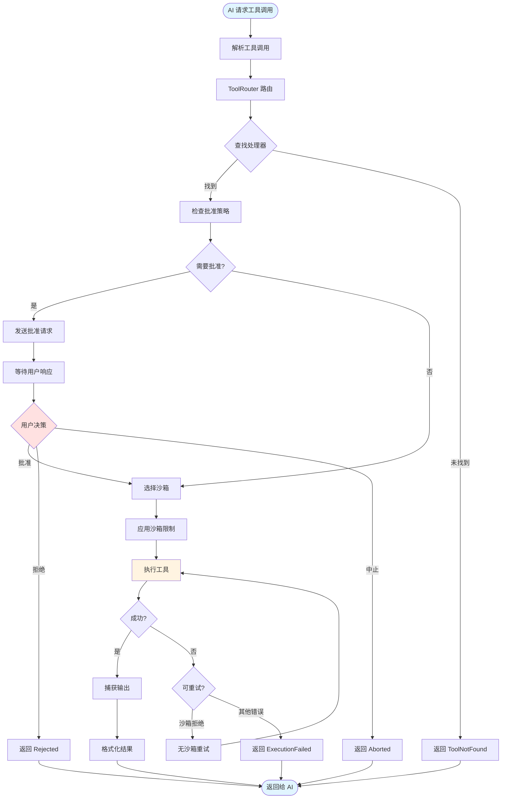
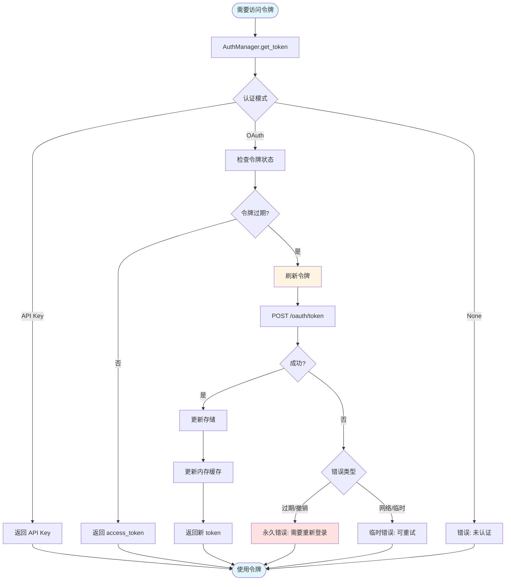
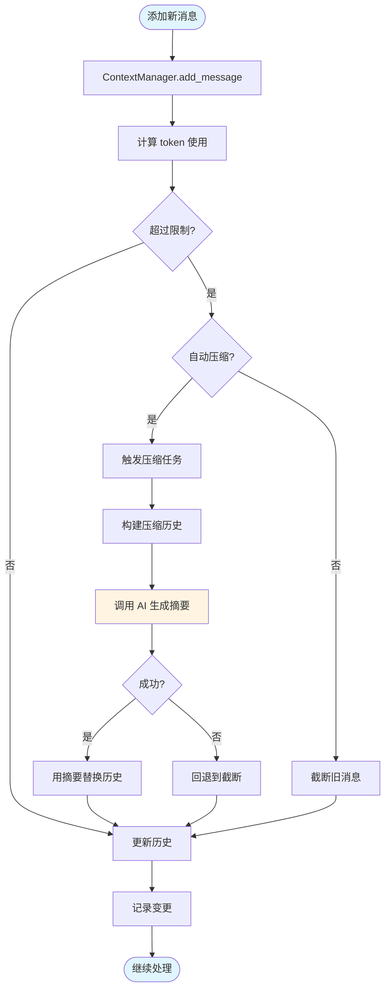
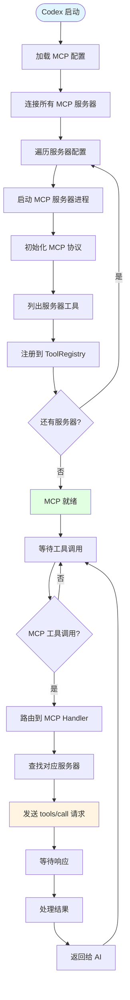
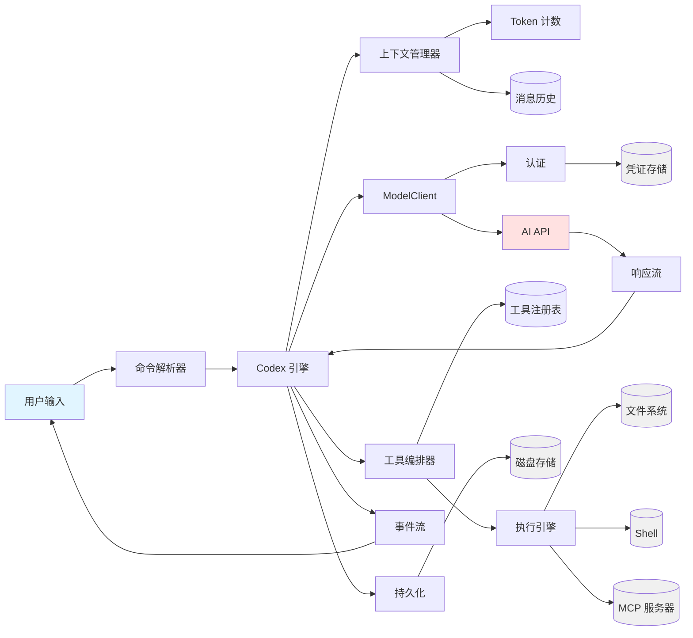
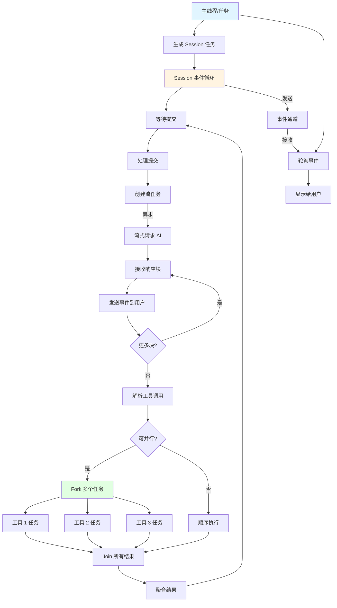
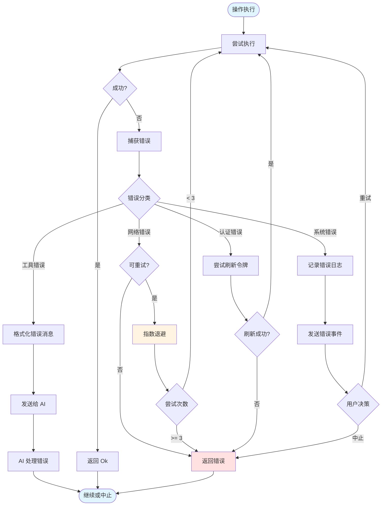

# codex-core 运行机制流程图

## 1. 系统整体架构

## 2. 完整交互流程

## 3. 会话生命周期

## 4. 工具执行流程

## 5. 认证和令牌管理

## 6. 上下文管理和压缩

## 7. MCP 集成流程

## 8. 数据流图

## 9. 并发模型

## 10. 错误处理流程

## 流程图说明

### 图 1: 系统整体架构
展示了 codex-core 的主要组件及其关系。

### 图 2: 完整交互流程
展示从用户提交到 AI 响应再到工具执行的完整序列。

### 图 3: 会话生命周期
展示会话的各个状态及状态转换。

### 图 4: 工具执行流程
详细展示工具调用的处理流程，包括批准和沙箱。

### 图 5: 认证和令牌管理
展示认证系统如何获取和刷新访问令牌。

### 图 6: 上下文管理和压缩
展示如何管理对话上下文并在必要时进行压缩。

### 图 7: MCP 集成流程
展示 MCP 服务器的连接和工具调用流程。

### 图 8: 数据流图
展示数据在各个组件间的流动。

### 图 9: 并发模型
展示异步任务的创建和并发执行模型。

### 图 10: 错误处理流程
展示错误的捕获、分类和处理策略。
