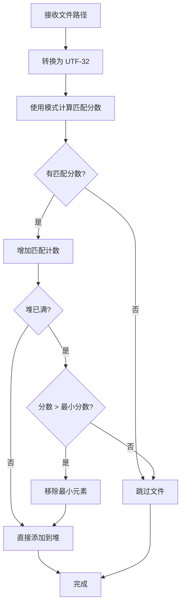
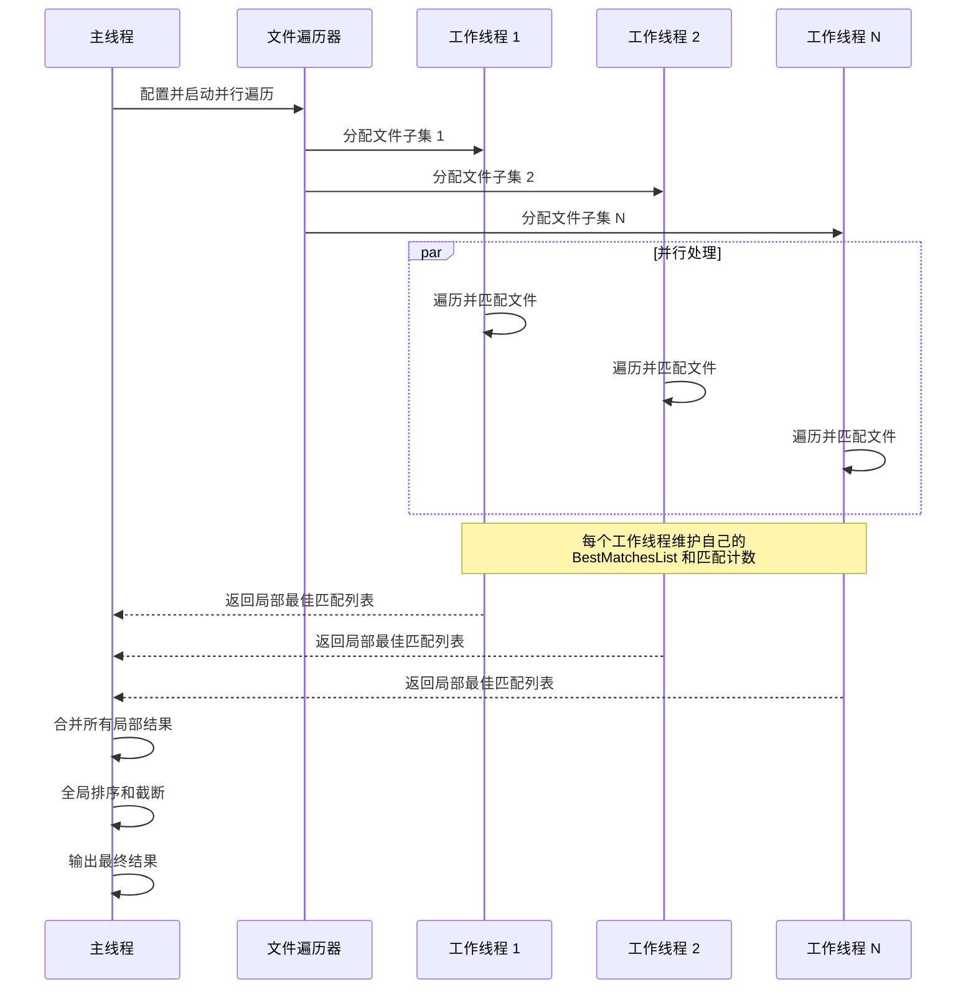
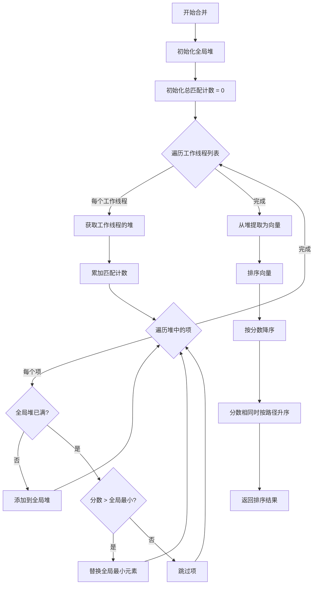
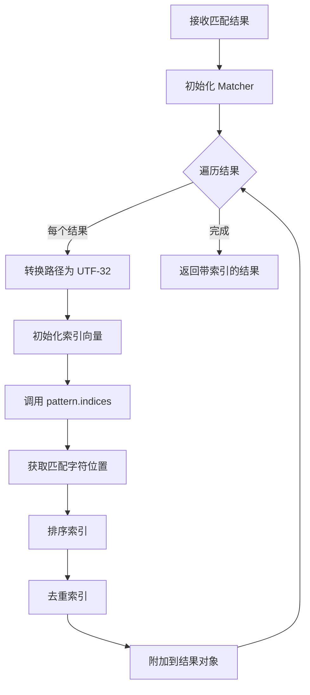
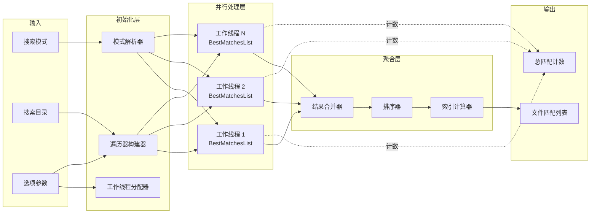
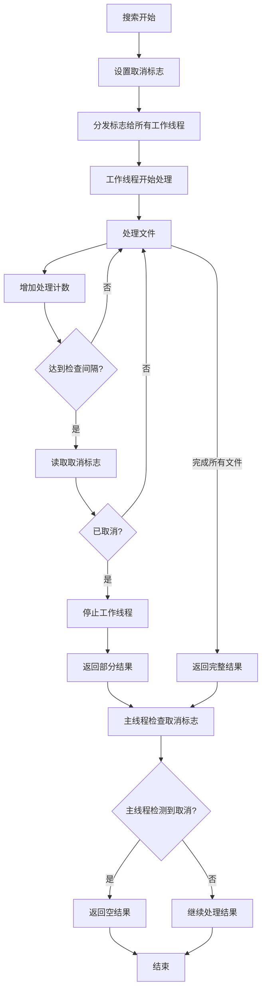
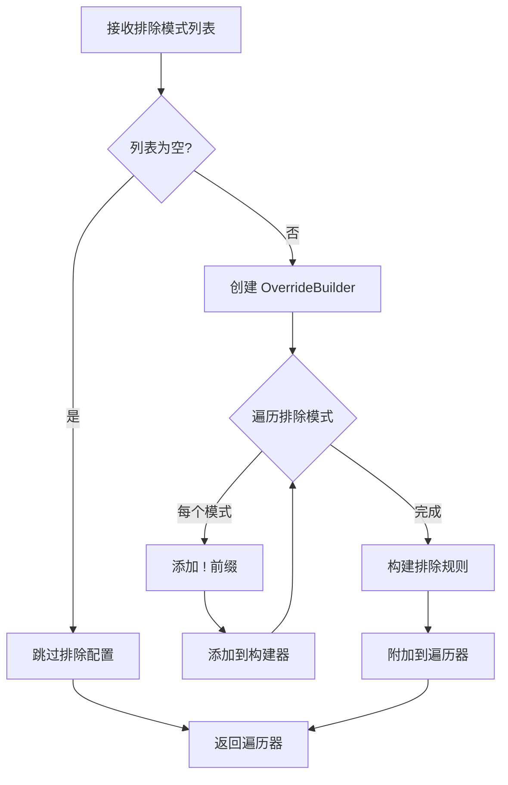

# file-search 流程图

## 概述

`file-search` crate 实现了一个高性能的模糊文件名搜索工具。它使用 `nucleo_matcher` 进行模糊匹配，使用 `ignore` crate 实现并行文件遍历，并支持 gitignore 规则。

## 1. 文件搜索主流程

```mermaid
flowchart TD
    Start[接收搜索请求] --> ParseArgs[解析命令行参数]
    ParseArgs --> CheckPattern{提供了搜索模式?}

    CheckPattern -->|否| ShowListing[显示目录列表]
    CheckPattern -->|是| InitSearch[初始化搜索]

    ShowListing --> ExecuteLs[执行 ls 命令]
    ExecuteLs --> End[结束]

    InitSearch --> CreatePattern[创建模糊匹配模式]
    CreatePattern --> CalculateWorkers[计算工作线程数量]
    CalculateWorkers --> InitWorkerData[初始化每个工作线程的数据]

    InitWorkerData --> ConfigureWalkBuilder[配置文件遍历器]
    ConfigureWalkBuilder --> SetThreads[设置线程数]
    SetThreads --> ConfigureIgnore{尊重 gitignore?}

    ConfigureIgnore -->|是| EnableGitIgnore[启用 git 忽略规则]
    ConfigureIgnore -->|否| DisableGitIgnore[禁用 git 忽略规则]

    EnableGitIgnore --> CheckExclude{有排除模式?}
    DisableGitIgnore --> CheckExclude

    CheckExclude -->|是| BuildExcludePatterns[构建排除规则]
    CheckExclude -->|否| BuildWalker[构建并行遍历器]

    BuildExcludePatterns --> BuildWalker

    BuildWalker --> StartParallelWalk[启动并行文件遍历]
    StartParallelWalk --> WorkerLoop{遍历文件}

    WorkerLoop -->|每个文件| FilterEntry{是文件?}
    FilterEntry -->|是| MatchPattern[模糊匹配文件路径]
    FilterEntry -->|否| WorkerLoop

    MatchPattern --> CheckScore{匹配成功?}
    CheckScore -->|是| InsertToBestList[插入到最佳匹配列表]
    CheckScore -->|否| WorkerLoop

    InsertToBestList --> CheckCancel{检查取消标志}
    CheckCancel -->|已取消| StopWalk[停止遍历]
    CheckCancel -->|继续| WorkerLoop

    WorkerLoop -->|完成| MergeResults[合并各工作线程结果]
    StopWalk --> MergeResults

    MergeResults --> SortResults[排序结果]
    SortResults --> CheckComputeIndices{需要计算索引?}

    CheckComputeIndices -->|是| ComputeMatchIndices[计算匹配字符索引]
    CheckComputeIndices -->|否| FormatResults[格式化结果]

    ComputeMatchIndices --> FormatResults
    FormatResults --> OutputResults[输出结果]
    OutputResults --> CheckTruncated{结果被截断?}

    CheckTruncated -->|是| ShowTruncatedWarning[显示截断警告]
    CheckTruncated -->|否| End

    ShowTruncatedWarning --> End
```

## 2. 最佳匹配列表维护流程

## 3. 工作线程并行处理流程

## 4. 结果合并和排序流程

## 5. 模糊匹配索引计算流程

## 6. 数据流图

## 7. 取消机制流程

## 8. 排除模式处理流程

## 关键决策点

1. **模式提供检查**：如果没有提供搜索模式，显示目录列表而不是搜索
2. **文件类型过滤**：只处理文件，跳过目录
3. **匹配分数评估**：只保留有匹配分数的文件（非 None）
4. **堆容量检查**：当堆未满时直接插入；已满时比较分数
5. **取消检查间隔**：每 1024 个文件检查一次取消标志以平衡性能和响应性
6. **索引计算选项**：仅在明确请求时计算匹配字符索引
7. **gitignore 尊重**：可配置是否遵循 git 忽略规则

## 性能优化

### 并行化策略

- 使用 `ignore` crate 的并行文件遍历
- 每个工作线程维护独立的 BestMatchesList
- 工作线程数 = 指定线程数 + 1（遍历器实现细节）

### 内存管理

- 使用二叉堆维护 top-N 结果
- 限制每个工作线程的内存使用
- UTF-32 转换缓冲区重用

### 取消检查优化

- 批量处理减少原子操作开销
- 检查间隔为 1024 个文件

## 匹配算法特性

### 模糊匹配配置

- **大小写匹配**：Smart（智能大小写）
- **标准化**：Smart（智能标准化）
- **原子类型**：Fuzzy（模糊匹配）

### 排序规则

1. 首先按匹配分数降序排列（分数高的在前）
2. 分数相同时按文件路径字母顺序排列（字典序）
