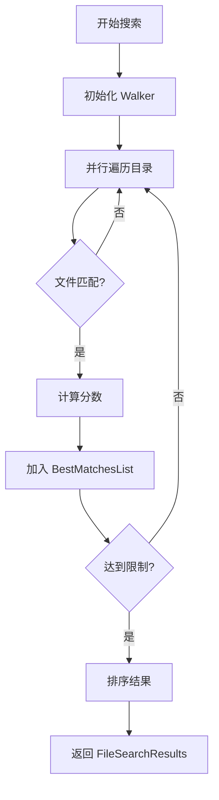

# file-search

## 文件在整体的作用

`codex-file-search` 提供高性能的文件搜索工具，使用模糊匹配和并行文件遍历来快速找到相关文件。它是 Codex 工具系统的一部分，帮助 AI 在大型代码库中定位文件。

## 主要结构体

### `FileMatch`
```rust
pub struct FileMatch {
    pub score: u32,
    pub path: PathBuf,
    pub indices: Vec<u32>,
}
```
- 单个文件匹配结果
- `score`: 匹配分数（越高越好）
- `path`: 文件路径
- `indices`: 匹配字符的位置索引

### `FileSearchResults`
```rust
pub struct FileSearchResults {
    pub matches: Vec<FileMatch>,
    pub total_files: usize,
    pub search_time_ms: u64,
}
```
- 搜索结果集合
- 包含匹配项和统计信息

### `BestMatchesList`
- 内部结构，维护最佳匹配的优先队列
- 限制结果数量，只保留最相关的匹配

## 主要函数

### `run(pattern, root, exclude, limit, num_threads) -> Result<FileSearchResults>`
- 执行文件搜索主函数
- **参数**：
  - `pattern`: 搜索模式（模糊匹配）
  - `root`: 根目录
  - `exclude`: 排除模式列表
  - `limit`: 最大结果数
  - `num_threads`: 并行线程数

### `run_main() -> Result<()>`
- CLI 入口函数
- 解析命令行参数并执行搜索

### `cmp_by_score_desc_then_path_asc(a, b) -> Ordering`
- 排序比较器
- 先按分数降序，再按路径升序

## 搜索算法

### 模糊匹配
- 使用 `nucleo_matcher` (来自 Helix 编辑器)
- 支持非连续字符匹配
- 示例：查询 "src" 可匹配 "**s**ou**rc**e.rs"

### 文件遍历
- 使用 `ignore` crate (来自 ripgrep)
- 自动遵守 `.gitignore`
- 并行目录遍历

## 使用示例

### 作为库
```rust
use codex_file_search::run;

let results = run(
    "main",           // 模式
    ".",              // 根目录
    vec!["target"],   // 排除
    100,              // 限制
    Some(4),          // 线程数
)?;

for m in results.matches {
    println!("{} (分数: {})", m.path.display(), m.score);
}
```

### 作为 CLI
```bash
file-search "main" --root . --exclude target --limit 20
```

## 性能优化

- ✅ 并行文件遍历（多线程）
- ✅ 限制结果数量（避免过多匹配）
- ✅ 早期终止（找到足够结果后停止）
- ✅ 高效的 gitignore 处理

## 工作流程



## 依赖关系

- `ignore`: 文件遍历和 gitignore 支持
- `nucleo_matcher`: 模糊匹配算法
- `clap`: CLI 参数解析
- `anyhow`: 错误处理

## 在项目中的位置

```
┌────────────────────┐
│  Codex AI         │
│  "查找 main 文件"  │
└─────────┬──────────┘
          │
┌─────────▼──────────┐
│  codex-core       │
│  (调用工具)        │
└─────────┬──────────┘
          │
┌─────────▼──────────┐
│  file-search      │ ← 此 crate
└─────────┬──────────┘
          │
┌─────────▼──────────┐
│  文件系统          │
└────────────────────┘
```

## 输出格式

### JSON 格式（用于工具调用）
```json
{
  "matches": [
    {
      "score": 1250,
      "path": "src/main.rs",
      "indices": [4, 5, 6, 7]
    }
  ],
  "total_files": 523,
  "search_time_ms": 42
}
```
