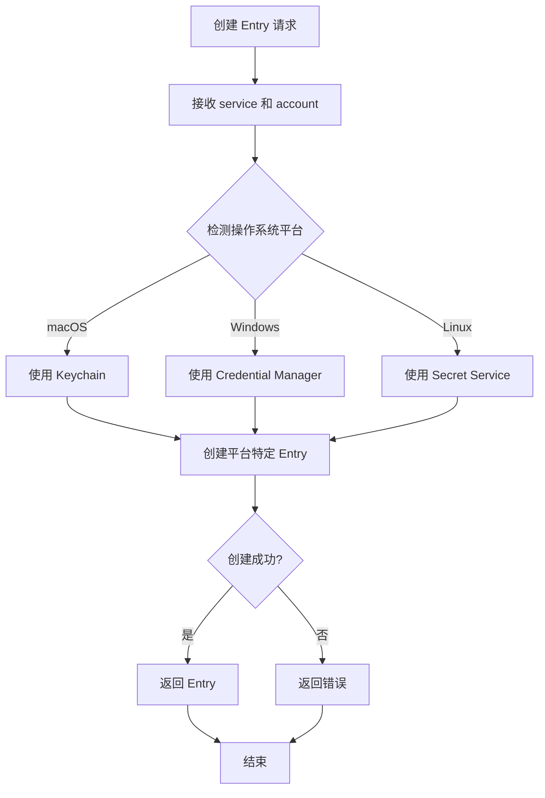
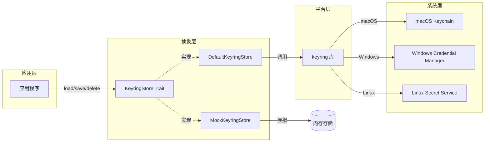
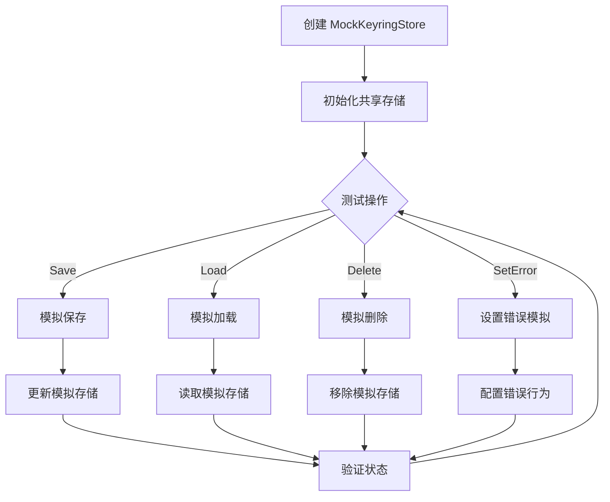
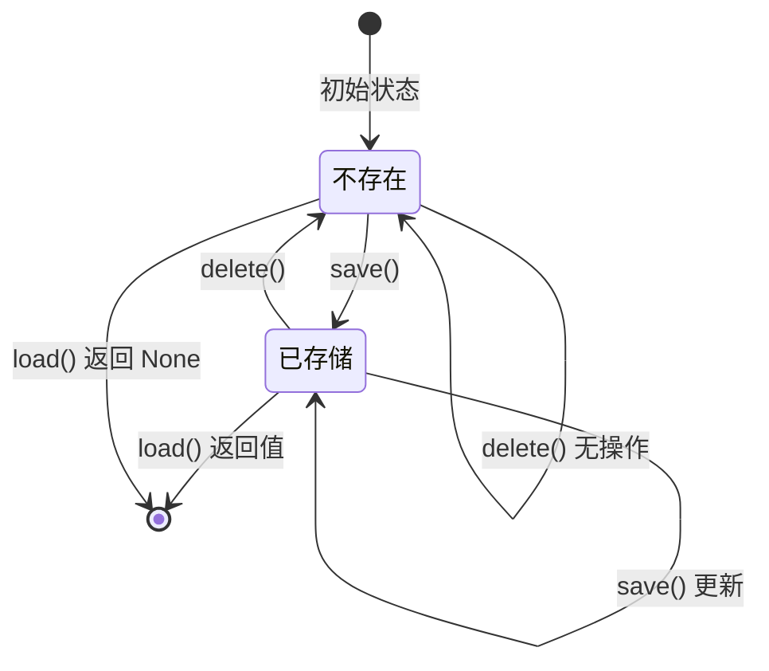

# keyring-store 流程图

## 概述

`keyring-store` crate 提供了一个跨平台的凭据存储抽象层，封装了系统原生密钥环（keyring）功能。它支持加载、保存和删除敏感凭据。

## 1. 凭据加载流程

```mermaid
flowchart TD
    Start[接收加载请求] --> LogStart[记录开始日志]
    LogStart --> CreateEntry[创建 Entry]

    CreateEntry --> CheckEntryCreation{Entry 创建成功?}
    CheckEntryCreation -->|失败| ReturnError[返回错误]
    CheckEntryCreation -->|成功| GetPassword[获取密码]

    GetPassword --> CheckResult{获取结果}

    CheckResult -->|成功| LogSuccess[记录成功日志]
    CheckResult -->|NoEntry 错误| LogNoEntry[记录无条目日志]
    CheckResult -->|其他错误| LogError[记录错误日志]

    LogSuccess --> ReturnSome[返回 Some(password)]
    LogNoEntry --> ReturnNone[返回 None]
    LogError --> ReturnError

    ReturnSome --> End[结束]
    ReturnNone --> End
    ReturnError --> End
```

## 2. 凭据保存流程

```mermaid
flowchart TD
    Start[接收保存请求] --> LogStart[记录开始日志]
    LogStart --> CreateEntry[创建 Entry]

    CreateEntry --> CheckEntryCreation{Entry 创建成功?}
    CheckEntryCreation -->|失败| ReturnError[返回错误]
    CheckEntryCreation -->|成功| SetPassword[设置密码]

    SetPassword --> CheckResult{设置结果}

    CheckResult -->|成功| LogSuccess[记录成功日志]
    CheckResult -->|失败| LogError[记录错误日志]

    LogSuccess --> ReturnOk[返回 Ok(())]
    LogError --> ReturnError[返回错误]

    ReturnOk --> End[结束]
    ReturnError --> End
```

## 3. 凭据删除流程

```mermaid
flowchart TD
    Start[接收删除请求] --> LogStart[记录开始日志]
    LogStart --> CreateEntry[创建 Entry]

    CreateEntry --> CheckEntryCreation{Entry 创建成功?}
    CheckEntryCreation -->|失败| ReturnError[返回错误]
    CheckEntryCreation -->|成功| DeleteCredential[删除凭据]

    DeleteCredential --> CheckResult{删除结果}

    CheckResult -->|成功| LogSuccess[记录成功日志]
    CheckResult -->|NoEntry 错误| LogNoEntry[记录无条目日志]
    CheckResult -->|其他错误| LogError[记录错误日志]

    LogSuccess --> ReturnTrue[返回 Ok(true)]
    LogNoEntry --> ReturnFalse[返回 Ok(false)]
    LogError --> ReturnError[返回错误]

    ReturnTrue --> End[结束]
    ReturnFalse --> End
    ReturnError --> End
```

## 4. Entry 创建和平台适配流程



## 5. 数据流图



## 6. 错误处理流程

```mermaid
flowchart TD
    Start[捕获 keyring 错误] --> ClassifyError{分类错误类型}

    ClassifyError -->|NoEntry| HandleNoEntry[处理无条目错误]
    ClassifyError -->|其他错误| WrapError[包装为 CredentialStoreError]

    HandleNoEntry --> CheckOperation{检查操作类型}
    CheckOperation -->|Load| ReturnNone[返回 None]
    CheckOperation -->|Delete| ReturnFalse[返回 Ok(false)]

    WrapError --> AddContext[添加上下文信息]
    AddContext --> ReturnError[返回错误]

    ReturnNone --> End[结束]
    ReturnFalse --> End
    ReturnError --> End
```

## 7. Mock 实现测试流程



## 8. 状态转换图



## 关键决策点

1. **Entry 创建失败处理**：如果无法创建 Entry，立即返回错误
2. **NoEntry 错误特殊处理**：区分"凭据不存在"和"其他错误"
3. **平台检测**：keyring 库自动根据平台选择后端
4. **日志记录**：在每个操作的开始、成功和失败时记录日志
5. **测试模式**：使用 MockKeyringStore 进行单元测试，避免依赖系统密钥环

## 平台支持

### macOS
- 后端：Keychain Services API
- 存储位置：系统钥匙串（System Keychain）或登录钥匙串（Login Keychain）

### Windows
- 后端：Credential Manager API
- 存储位置：Windows Credential Manager

### Linux
- 后端：Secret Service API (GNOME Keyring, KWallet 等)
- 存储位置：桌面环境的密钥环服务

## 安全特性

1. **系统级加密**：凭据由操作系统加密存储
2. **访问控制**：受操作系统权限管理保护
3. **日志安全**：不记录实际密码内容，只记录长度
4. **错误包装**：统一错误类型，隐藏平台细节

## 使用模式

### 服务/账户标识

```
service: "my-application"
account: "user@example.com"
```

这种组合唯一标识一个凭据条目。

### 典型用例

1. **存储 API 密钥**：service = "app-name", account = "api-key"
2. **存储用户令牌**：service = "app-name", account = "user-email"
3. **存储OAuth令牌**：service = "oauth-provider", account = "user-id"
