# mcp-types 类型关系图

## 概述

`mcp-types` crate 定义了 Model Context Protocol (MCP) 的所有类型定义。这是一个自动生成的 crate，包含协议的请求、响应、通知和各种数据结构。

## 1. MCP 协议类型层次结构

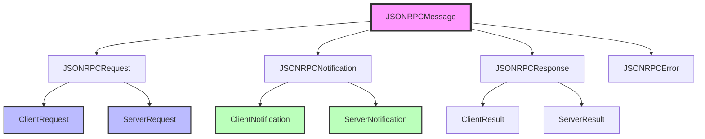

## 2. 客户端请求类型

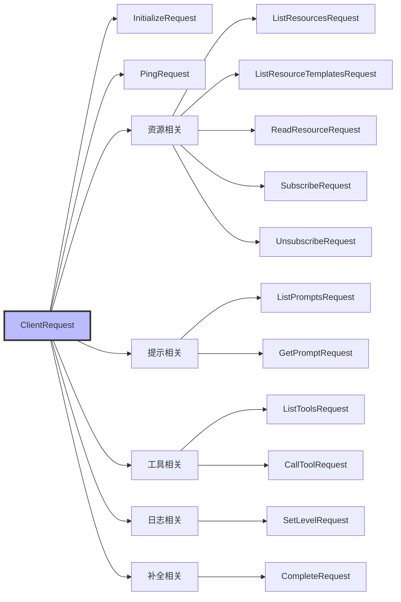

## 3. 服务器通知类型

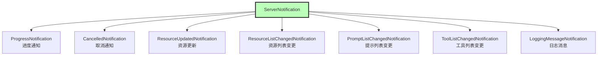

## 4. 内容块类型层次

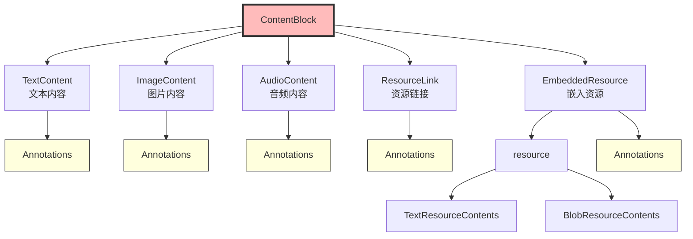

## 5. 协议握手流程

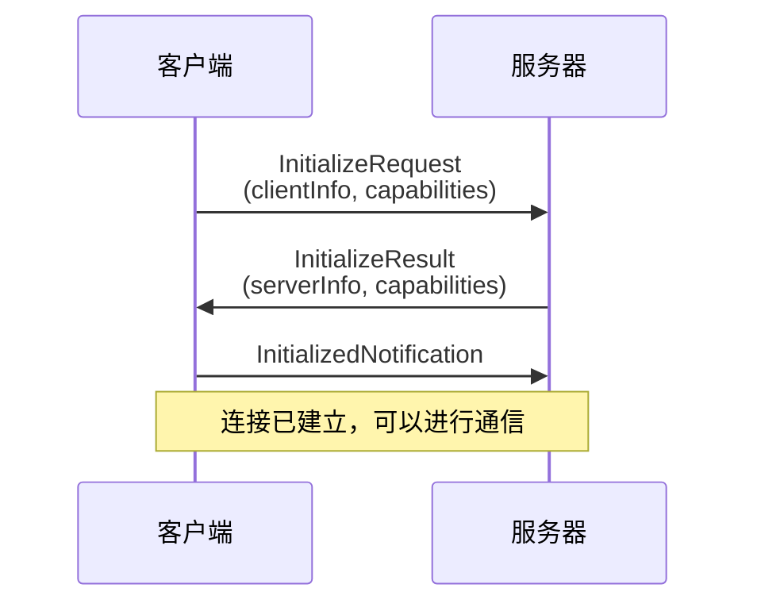

## 6. Trait 关系

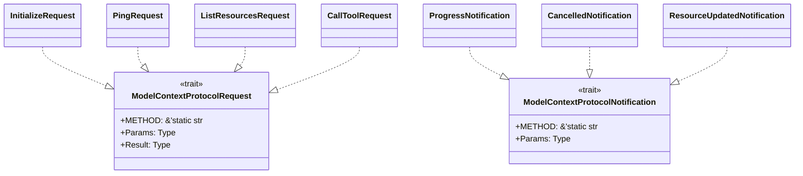

## 7. 工具定义结构

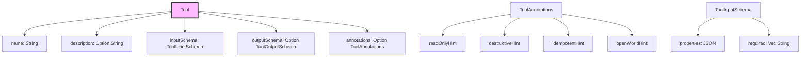

## 8. 资源类型关系

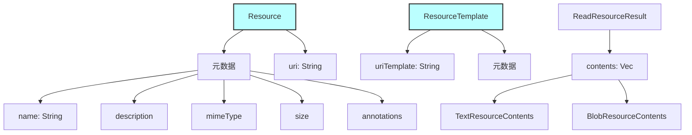

## 9. Schema 类型定义

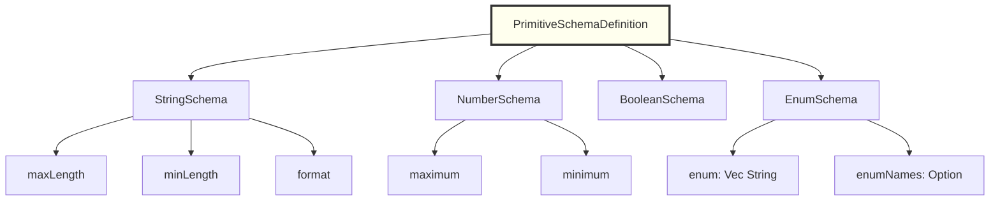

## 10. 能力协商

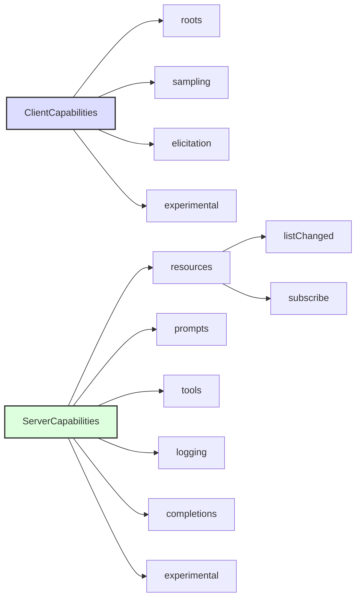

## 11. 消息 ID 类型

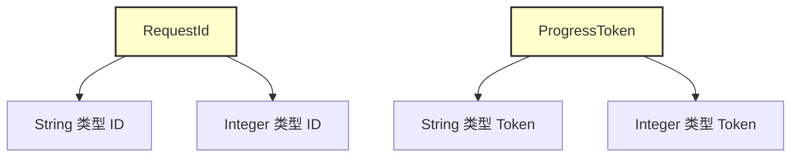

## 12. 角色枚举

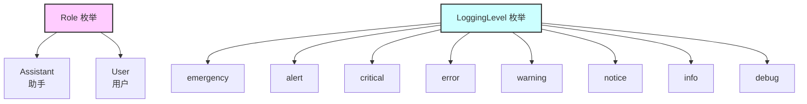

## 核心概念

### 1. 请求/响应模式

每个请求类型实现 `ModelContextProtocolRequest` trait，定义：
- `METHOD`: 方法名常量
- `Params`: 请求参数类型
- `Result`: 响应结果类型

### 2. 通知模式

单向消息，实现 `ModelContextProtocolNotification` trait，定义：
- `METHOD`: 方法名常量
- `Params`: 通知参数类型

### 3. 内容类型

支持多种内容类型：
- **Text**: 纯文本
- **Image**: Base64 编码的图片
- **Audio**: Base64 编码的音频
- **Resource**: 资源链接或嵌入资源

### 4. 注解系统

`Annotations` 提供元数据：
- `audience`: 目标受众（角色列表）
- `priority`: 优先级
- `lastModified`: 最后修改时间

## 类型转换

### JSONRPCRequest → ClientRequest

```rust
impl TryFrom<JSONRPCRequest> for ClientRequest {
    // 根据 method 字段路由到具体的请求类型
}
```

### JSONRPCNotification → ServerNotification

```rust
impl TryFrom<JSONRPCNotification> for ServerNotification {
    // 根据 method 字段路由到具体的通知类型
}
```

## 序列化特性

所有类型都支持：
- **Serde**: JSON 序列化/反序列化
- **JsonSchema**: JSON Schema 生成
- **TS**: TypeScript 类型定义生成

## 协议版本

- **Schema Version**: `2025-06-18`
- **JSON-RPC Version**: `2.0`

## 扩展性

协议支持实验性功能：
- `ClientCapabilities.experimental`
- `ServerCapabilities.experimental`

允许各方定义自定义能力而不破坏兼容性。
