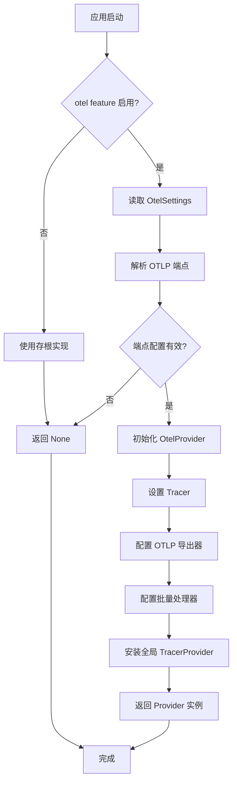
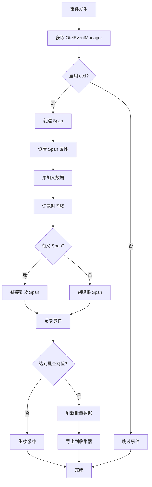
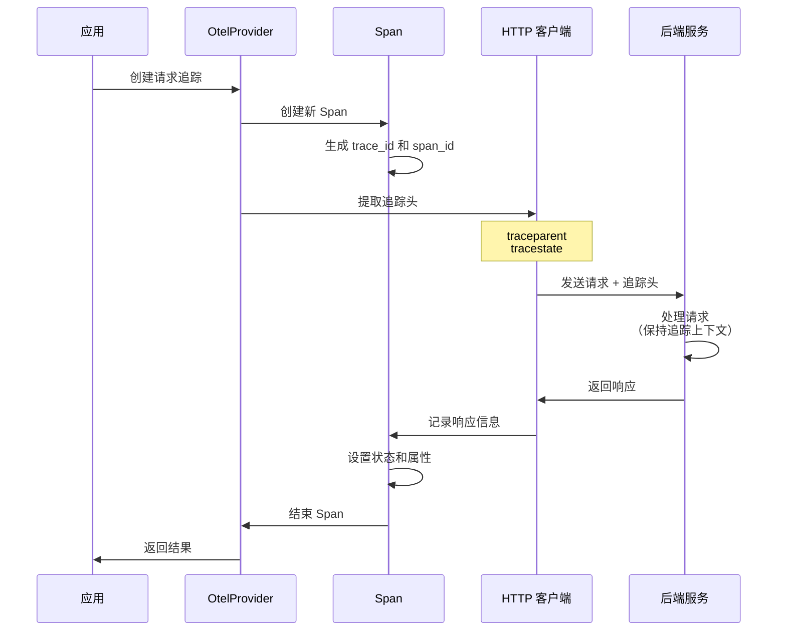
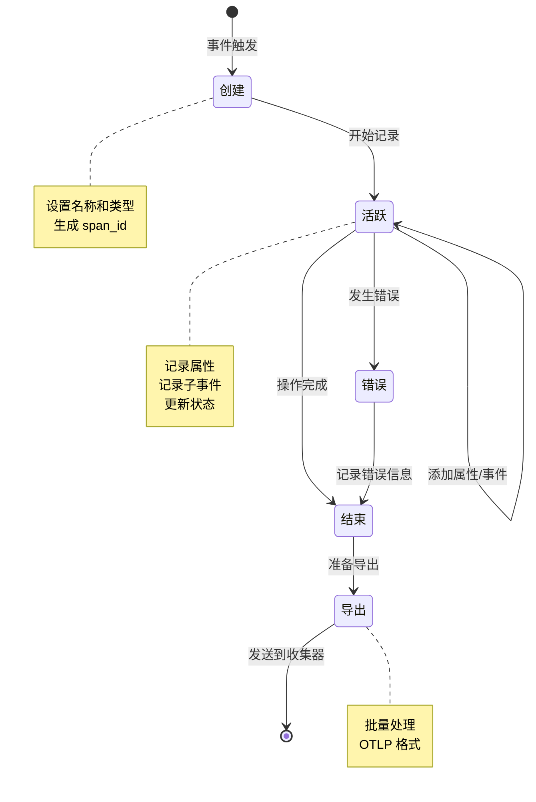
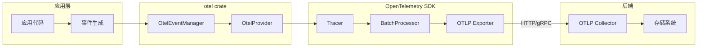
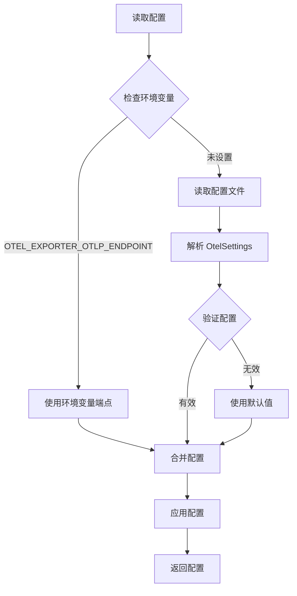
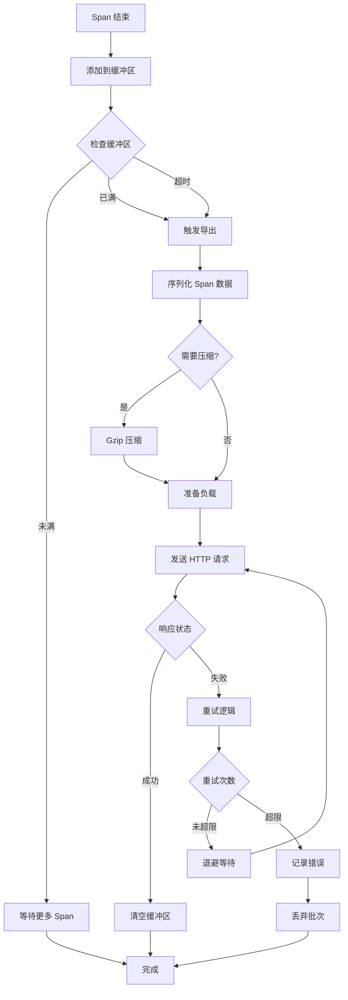
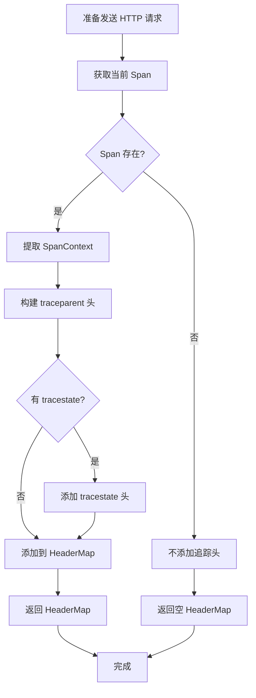

# otel 流程图

## 概述

`otel` crate 提供了 OpenTelemetry 遥测功能的集成，支持跟踪、指标和日志记录。它可以通过 feature flag 启用或禁用。

## 1. OpenTelemetry 初始化流程



## 2. 事件记录流程



## 3. HTTP 请求追踪流程



## 4. Span 生命周期管理



## 5. 数据流图



## 6. 配置加载流程



## 7. 批量处理和导出流程



## 8. HTTP 头注入流程



## 关键决策点

1. **Feature Flag 检查**：在编译时决定是使用真实实现还是存根实现
2. **端点配置**：从环境变量或配置文件读取 OTLP 端点
3. **批量阈值**：达到数量或时间阈值时触发导出
4. **重试策略**：失败时使用指数退避重试
5. **Span 父子关系**：自动链接父子 Span 以构建追踪树

## 配置项

### OtelSettings 结构

```rust
pub struct OtelSettings {
    pub endpoint: Option<String>,
    pub service_name: String,
    pub batch_size: usize,
    pub export_timeout: Duration,
}
```

### 环境变量

- `OTEL_EXPORTER_OTLP_ENDPOINT`: OTLP 收集器端点
- `OTEL_SERVICE_NAME`: 服务名称
- `OTEL_LOG_LEVEL`: 日志级别

## Span 属性

常见的 Span 属性：
- `service.name`: 服务名称
- `operation.name`: 操作名称
- `http.method`: HTTP 方法
- `http.url`: HTTP URL
- `http.status_code`: HTTP 状态码
- `error`: 是否发生错误
- `error.message`: 错误消息

## 性能优化

1. **批量处理**：减少网络往返次数
2. **异步导出**：不阻塞主线程
3. **背压控制**：限制内存使用
4. **采样策略**：按比例采样以减少开销
5. **Feature Flag**：禁用时零开销

## 与 Tracing 集成

`otel` crate 与 Rust 的 `tracing` crate 集成：

- 使用 `tracing::Span` 作为基础
- 自动转换 `tracing` 事件到 OpenTelemetry
- 支持结构化日志和属性
