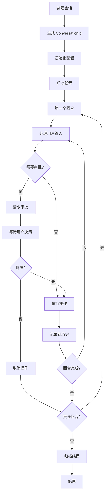
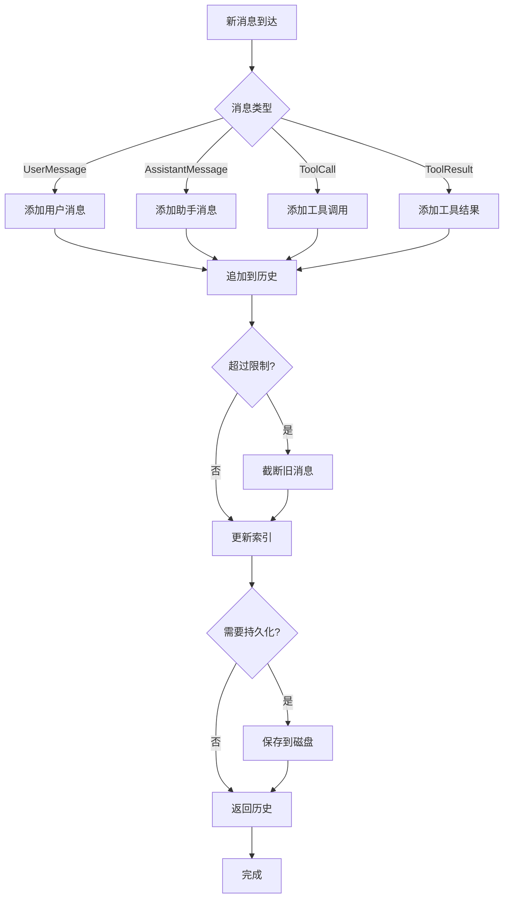
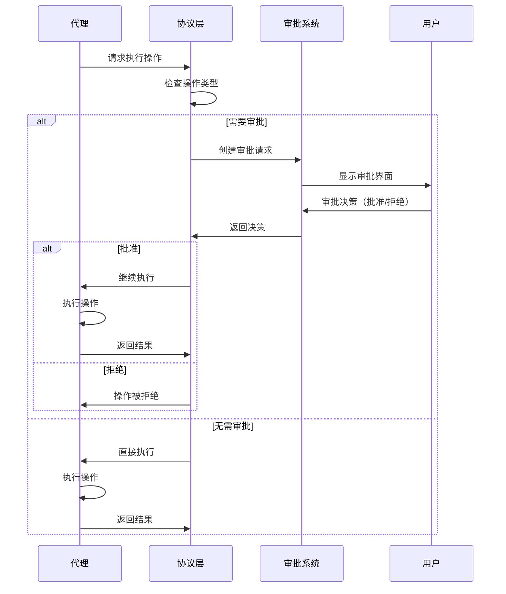
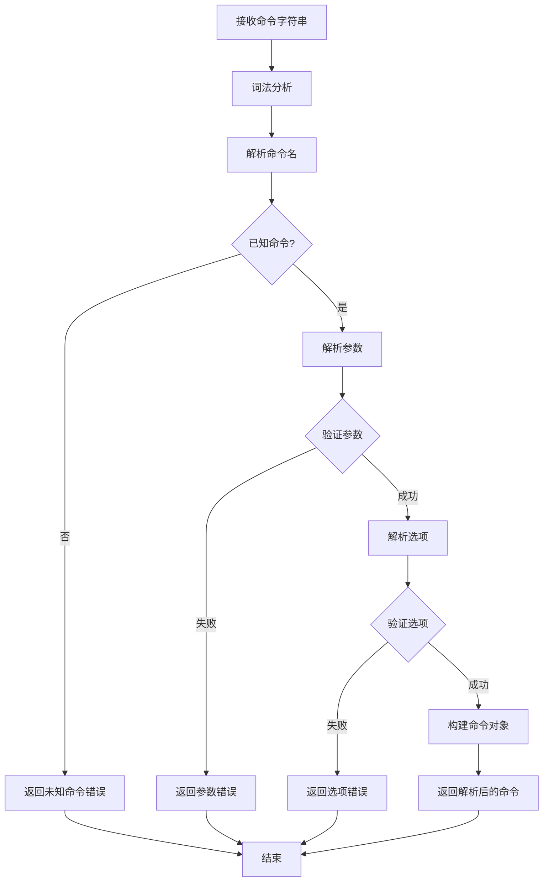
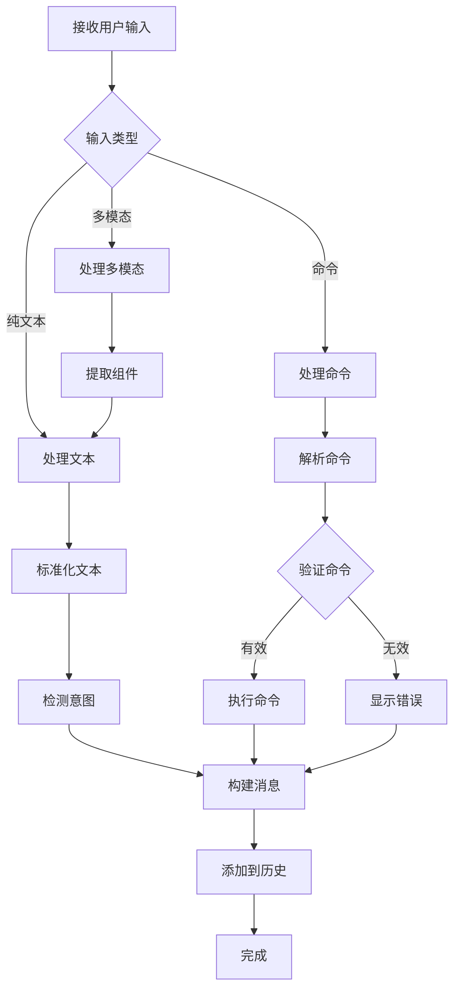
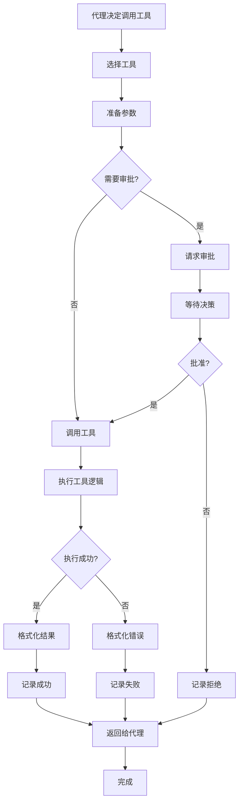
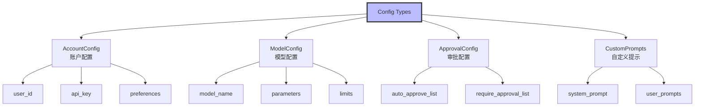
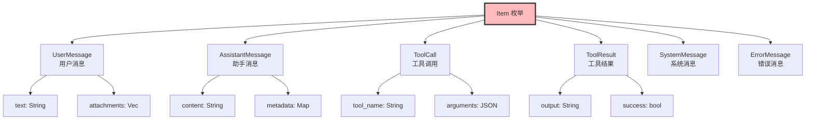
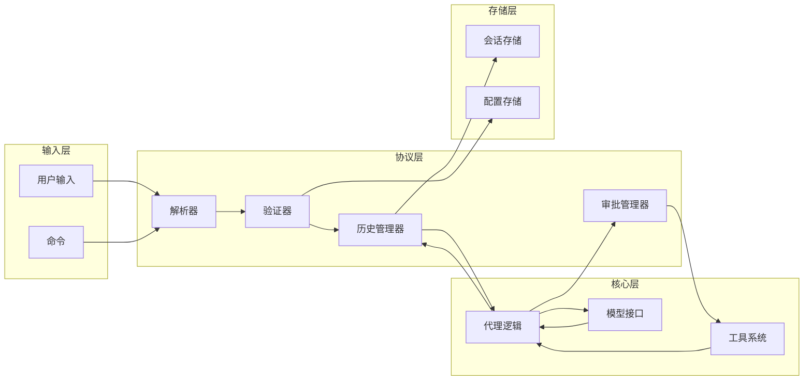
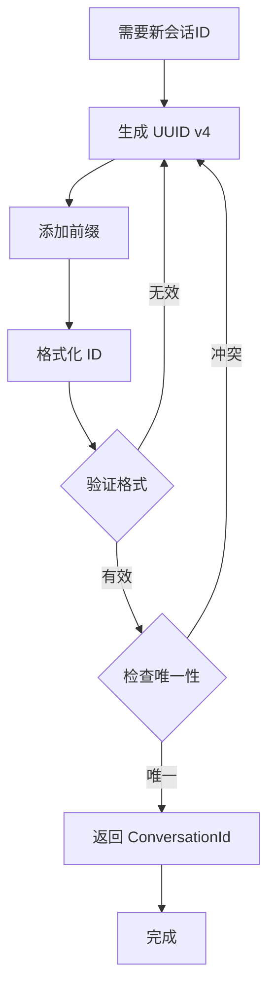

# protocol 流程图

## 概述

`protocol` crate (也称为 `codex-protocol`) 定义了 Codex 系统的核心协议类型和消息结构。它包含会话管理、消息历史、审批流程、工具调用等核心功能的类型定义。

## 1. 会话生命周期流程



## 2. 消息历史管理流程



## 3. 审批流程



## 4. 命令解析流程



## 5. 用户输入处理流程



## 6. 工具调用流程



## 7. 配置类型层次



## 8. 消息项类型



## 9. 计划工具流程

```mermaid
flowchart TD
    Start[激活计划工具] --> AnalyzeTask[分析任务]
    AnalyzeTask --> DecomposeTask[分解任务]

    DecomposeTask --> CreateSteps[创建步骤列表]
    CreateSteps --> EstimateComplexity[估算复杂度]

    EstimateComplexity --> AssignTools[分配工具]
    AssignTools --> BuildPlan[构建执行计划]

    BuildPlan --> ValidatePlan{验证计划}
    ValidatePlan -->|失败| RefineP lan[优化计划]
    ValidatePlan -->|成功| PresentPlan[呈现计划]

    RefinePlan --> BuildPlan

    PresentPlan --> UserReview{用户审查}
    UserReview -->|修改| UpdatePlan[更新计划]
    UserReview -->|批准| ExecutePlan[执行计划]

    UpdatePlan --> PresentPlan

    ExecutePlan --> StepLoop{遍历步骤}
    StepLoop -->|每个步骤| ExecuteStep[执行步骤]
    ExecuteStep --> RecordProgress[记录进度]
    RecordProgress --> StepLoop

    StepLoop -->|完成| ReturnResults[返回结果]
    ReturnResults --> End[完成]
```

## 10. 数据流图



## 11. 会话ID生成流程



## 关键决策点

1. **消息类型识别**：根据消息内容确定类型（用户、助手、工具等）
2. **审批门槛**：检查操作是否需要用户审批
3. **命令验证**：解析并验证命令参数和选项
4. **历史限制**：控制消息历史的长度
5. **持久化策略**：决定何时保存会话数据

## 核心类型

### ConversationId
- 唯一标识一个会话
- 格式：UUID 字符串
- 用于跟踪和检索会话

### MessageHistory
- 存储完整的消息序列
- 支持分页和截断
- 可序列化和持久化

### ApprovalRequest
- 描述需要审批的操作
- 包含操作详情和风险评估
- 关联用户决策

### CustomPrompts
- 用户定义的提示模板
- 支持变量替换
- 可按场景分类

## 协议扩展点

1. **自定义工具**：添加新工具实现
2. **审批策略**：自定义审批规则
3. **消息格式**：扩展消息类型
4. **存储后端**：可插拔的存储实现

## 安全考虑

1. **输入验证**：所有用户输入都经过验证
2. **审批机制**：危险操作需要明确批准
3. **历史审计**：完整记录操作历史
4. **权限检查**：根据用户角色限制功能

## 性能优化

1. **懒加载**：按需加载历史消息
2. **缓存**：缓存常用配置
3. **批量操作**：批量处理消息
4. **索引**：为快速检索建立索引
