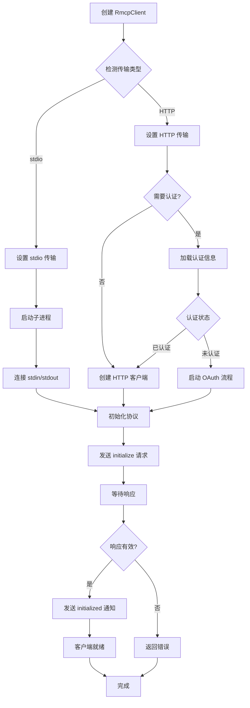
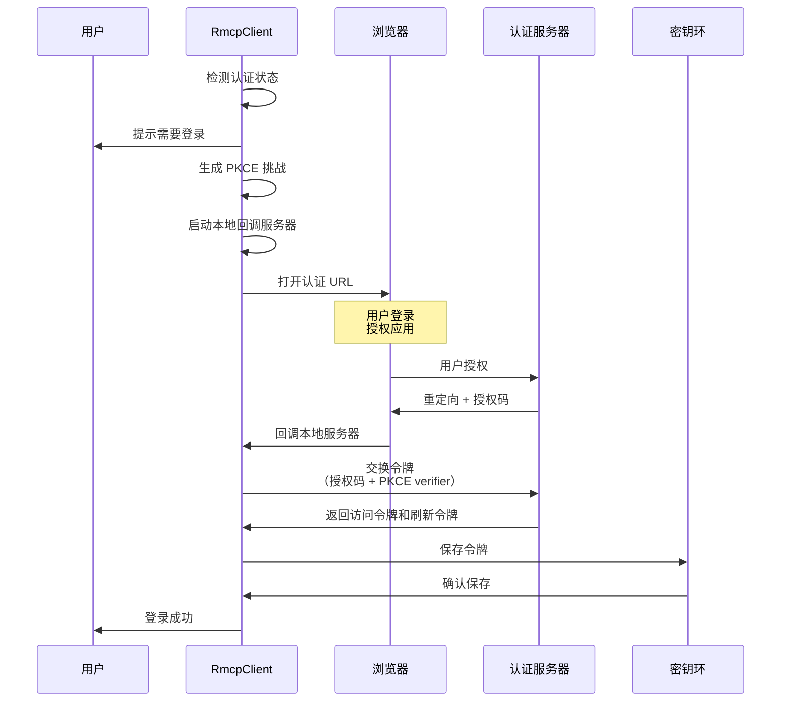
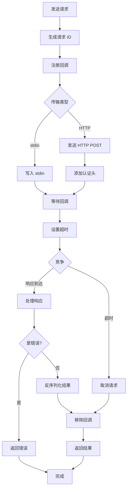
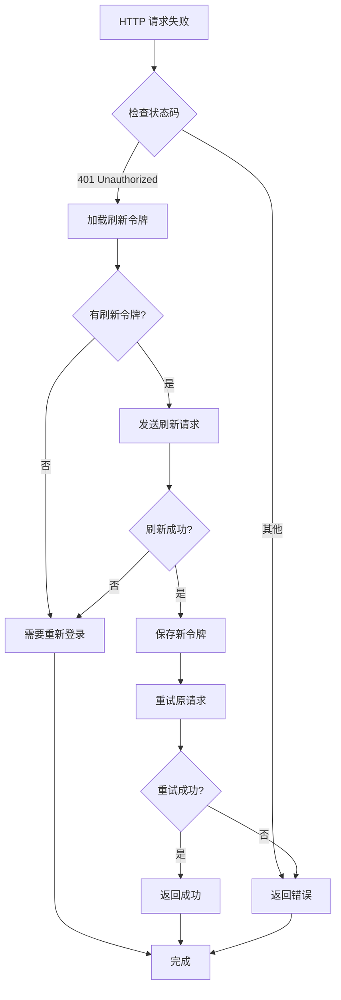
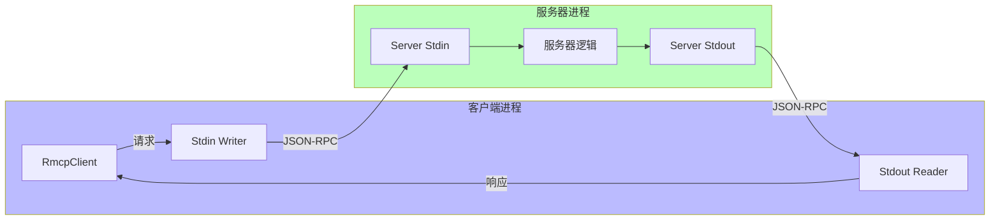
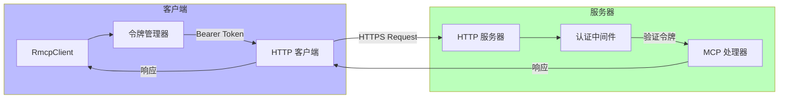
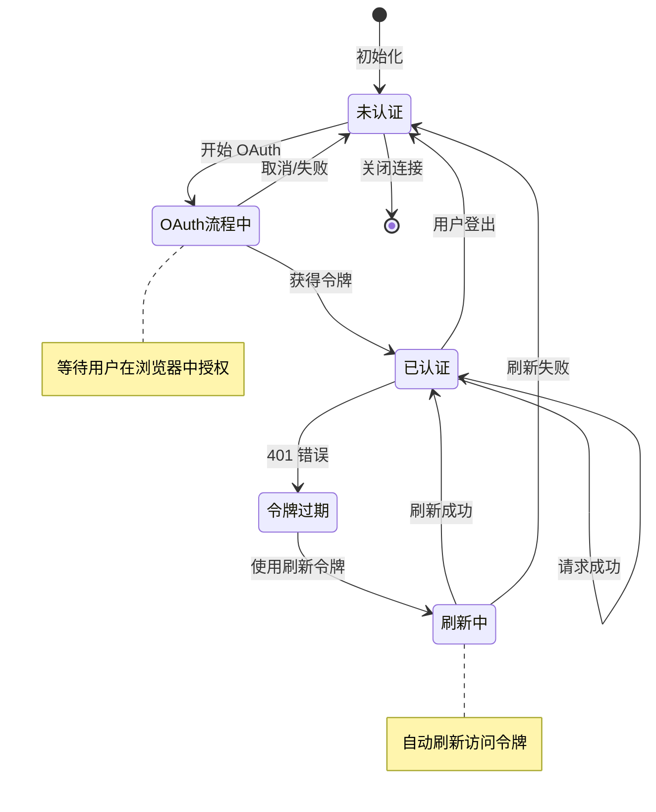
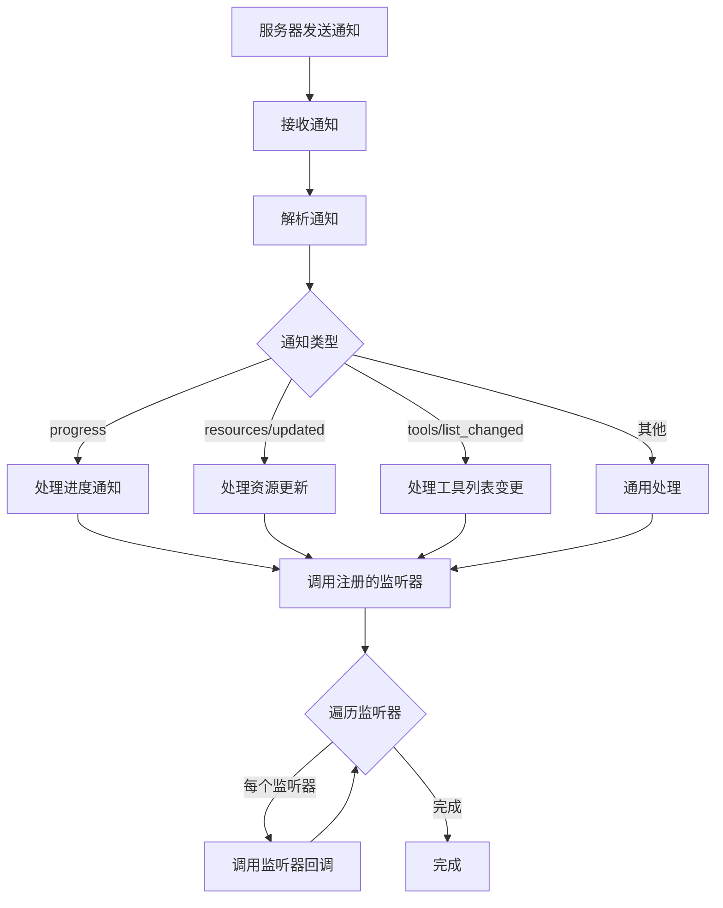
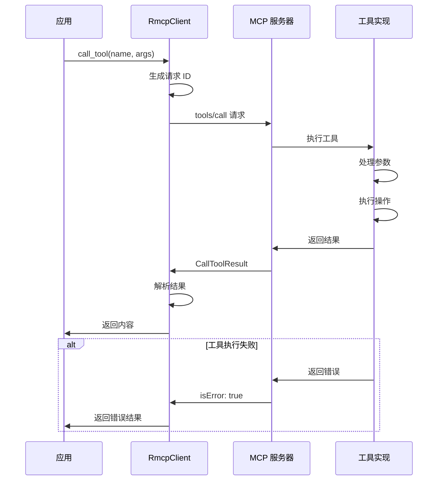

# rmcp-client 流程图

## 概述

`rmcp-client` crate 实现了 MCP (Model Context Protocol) 客户端，支持通过 stdio 和 HTTP 两种传输方式连接到 MCP 服务器，并包含 OAuth 认证功能。

## 1. MCP 客户端连接流程



## 2. OAuth 登录流程



## 3. 请求/响应处理流程



## 4. 令牌刷新流程



## 5. stdio 传输数据流



## 6. HTTP 传输数据流



## 7. 认证状态管理



## 8. 事件监听器模式



## 9. 工具调用流程



## 关键决策点

1. **传输方式选择**：根据配置选择 stdio 或 HTTP 传输
2. **认证检测**：HTTP 传输需要检查并处理认证
3. **令牌刷新时机**：收到 401 错误时自动刷新
4. **超时处理**：每个请求都有超时保护
5. **回调管理**：使用请求 ID 匹配请求和响应

## 错误处理策略

### 连接错误
- stdio: 进程启动失败或崩溃
- HTTP: 网络错误或服务器不可达

### 认证错误
- 令牌过期：自动刷新
- 令牌无效：要求重新登录
- OAuth 失败：提示用户重试

### 协议错误
- 初始化失败：版本不兼容
- 请求超时：取消并清理
- 解析错误：记录并返回错误

## 安全特性

1. **PKCE 流程**：防止授权码拦截攻击
2. **令牌存储**：使用系统密钥环安全存储
3. **HTTPS 传输**：加密网络通信
4. **令牌刷新**：最小化令牌暴露时间

## 性能优化

1. **连接复用**：HTTP 客户端复用连接
2. **并发请求**：支持多个请求同时进行
3. **异步 I/O**：非阻塞通信
4. **回调索引**：快速查找待处理请求

## 使用模式

### 基本请求
```rust
let result = client.request(method, params).await?;
```

### 订阅通知
```rust
client.subscribe_notifications(|notif| {
    // 处理通知
}).await?;
```

### 工具调用
```rust
let result = client.call_tool("tool_name", args).await?;
```
