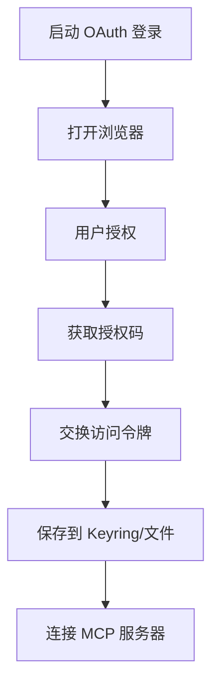

# rmcp-client

## 文件在整体的作用

`codex-rmcp-client` 基于官方 `rmcp` SDK 实现的 MCP (Model Context Protocol) 客户端，支持多种传输方式（子进程、HTTP、HTTP+OAuth）和完整的 OAuth 认证流程。它允许 Codex 连接到 MCP 服务器以获取额外的工具和资源。

## 主要结构体

### `RmcpClient`
```rust
pub struct RmcpClient {
    transport: PendingTransport,
    client_handler: LoggingClientHandler,
    // ...
}
```
- MCP 客户端主类
- 管理传输和协议处理

### `PendingTransport` (enum)
```rust
pub enum PendingTransport {
    ChildProcess {
        command: String,
        args: Vec<String>,
        env: Option<HashMap<String, String>>,
    },
    StreamableHttp {
        url: String,
    },
    StreamableHttpWithOAuth {
        url: String,
        auth_params: OAuthParams,
    },
}
```
- 传输类型枚举
- 支持三种连接方式

### `OAuthParams`
```rust
pub struct OAuthParams {
    pub auth_url: String,
    pub token_url: String,
    pub client_id: String,
    pub scopes: Vec<String>,
}
```
- OAuth 参数配置

### `StoredOAuthTokens`
```rust
pub struct StoredOAuthTokens {
    pub access_token: String,
    pub refresh_token: Option<String>,
    pub expires_at: Option<i64>,
}
```
- 存储的 OAuth 令牌

### `OAuthCredentialsStoreMode`
```rust
pub enum OAuthCredentialsStoreMode {
    Keyring,
    File,
}
```
- OAuth 凭据存储模式

## 主要方法

### RmcpClient

#### `new(transport: PendingTransport) -> Self`
- 创建新的 MCP 客户端实例

#### `connect() -> Result<ConnectedClient>`
- 连接到 MCP 服务器
- 执行初始化握手

#### `list_tools() -> Result<Vec<Tool>>`
- 列出服务器提供的所有工具

#### `call_tool(name: &str, arguments: Value) -> Result<CallToolResult>`
- 调用 MCP 工具

#### `list_resources() -> Result<Vec<Resource>>`
- 列出可用资源

#### `read_resource(uri: &str) -> Result<ResourceContents>`
- 读取资源内容

### OAuth 相关

#### `perform_oauth_login(params, store_mode, server_name) -> Result<StoredOAuthTokens>`
- 执行 OAuth 登录流程
- 打开浏览器进行授权
- 保存令牌到 keyring/文件

#### `determine_streamable_http_auth_status(url, server_name, store_mode) -> AuthStatus`
- 确定 HTTP 服务器的认证状态
- 检查是否需要 OAuth

#### `supports_oauth_login(url) -> Result<bool>`
- 检查服务器是否支持 OAuth

## 传输类型详解

### ChildProcess（子进程）
```rust
PendingTransport::ChildProcess {
    command: "python".to_string(),
    args: vec!["-m".to_string(), "my_mcp_server".to_string()],
    env: Some(HashMap::from([
        ("DEBUG".to_string(), "1".to_string()),
    ])),
}
```
- 启动本地 MCP 服务器进程
- 通过 stdio 通信

### StreamableHttp（无认证 HTTP）
```rust
PendingTransport::StreamableHttp {
    url: "http://localhost:8080".to_string(),
}
```
- 连接到 HTTP MCP 服务器
- 无需认证

### StreamableHttpWithOAuth（带 OAuth）
```rust
PendingTransport::StreamableHttpWithOAuth {
    url: "https://api.example.com/mcp".to_string(),
    auth_params: OAuthParams {
        auth_url: "https://auth.example.com/authorize".to_string(),
        token_url: "https://auth.example.com/token".to_string(),
        client_id: "my_client_id".to_string(),
        scopes: vec!["mcp.read".to_string(), "mcp.write".to_string()],
    },
}
```
- 使用 OAuth 2.0 认证
- 自动处理令牌刷新

## OAuth 流程



### 代码示例
```rust
use codex_rmcp_client::*;

// 执行 OAuth 登录
let tokens = perform_oauth_login(
    oauth_params,
    OAuthCredentialsStoreMode::Keyring,
    "my_mcp_server",
).await?;

// 使用令牌连接
let transport = PendingTransport::StreamableHttpWithOAuth {
    url: "https://api.example.com/mcp".to_string(),
    auth_params: oauth_params,
};

let client = RmcpClient::new(transport);
let connected = client.connect().await?;
```

## 认证状态

### `AuthStatus` (enum)
```rust
pub enum AuthStatus {
    NotRequired,
    Authenticated,
    NeedsAuthentication,
    Failed(String),
}
```

## 日志处理

### `LoggingClientHandler`
- 实现 MCP 客户端处理器
- 记录所有请求和响应
- 用于调试

## 配置目录

### `find_codex_home() -> PathBuf`
- 查找 Codex 配置目录
- 默认：`~/.codex`
- 用于存储 OAuth 令牌

## 使用示例

### 子进程 MCP 服务器
```rust
let transport = PendingTransport::ChildProcess {
    command: "node".to_string(),
    args: vec!["server.js".to_string()],
    env: None,
};

let client = RmcpClient::new(transport);
let connected = client.connect().await?;

// 列出工具
let tools = connected.list_tools().await?;
for tool in tools {
    println!("工具: {}", tool.name);
}

// 调用工具
let result = connected.call_tool("search", json!({
    "query": "hello"
})).await?;
```

### HTTP MCP 服务器（无认证）
```rust
let transport = PendingTransport::StreamableHttp {
    url: "http://localhost:3000".to_string(),
};

let client = RmcpClient::new(transport);
let connected = client.connect().await?;

// 读取资源
let content = connected.read_resource("file:///data.json").await?;
```

## 依赖关系

- `rmcp`: 官方 MCP SDK
- `tokio`: 异步运行时
- `reqwest`: HTTP 客户端
- `serde` / `serde_json`: 序列化
- `codex-keyring-store`: 令牌存储

## 在项目中的位置

```
┌──────────────────────────┐
│  codex-core              │
│  (MCP 连接管理器)        │
└──────────┬───────────────┘
           │
┌──────────▼───────────────┐
│  rmcp-client             │ ← 此 crate
└──────────┬───────────────┘
           │
┌──────────▼───────────────┐
│  MCP 服务器              │
│  (工具和资源提供者)      │
└──────────────────────────┘
```

## 错误处理

```rust
match client.connect().await {
    Ok(connected) => {
        // 成功连接
    }
    Err(RmcpError::TransportFailed(msg)) => {
        eprintln!("传输失败: {}", msg);
    }
    Err(RmcpError::AuthenticationRequired) => {
        // 执行 OAuth 登录
        perform_oauth_login(...).await?;
    }
    Err(e) => {
        eprintln!("错误: {}", e);
    }
}
```

## 令牌存储位置

### Keyring 模式
- macOS: Keychain (`codex-mcp-{server_name}`)
- Windows: Credential Manager
- Linux: Secret Service

### File 模式
- `~/.codex/mcp_tokens/{server_name}.json`
