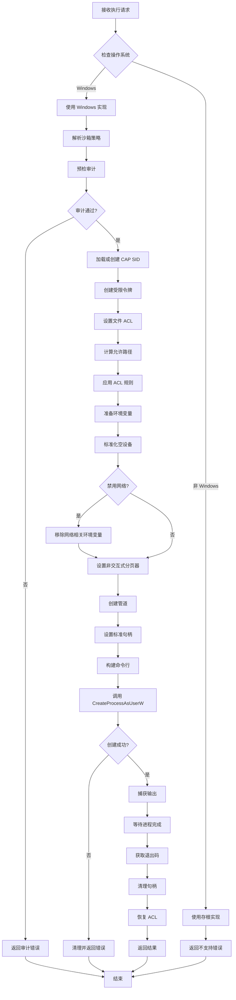
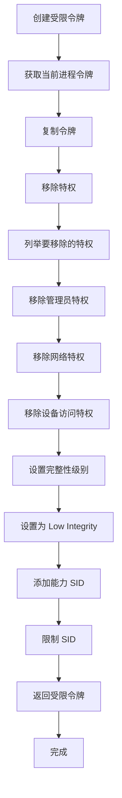
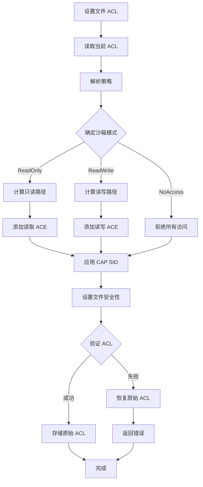
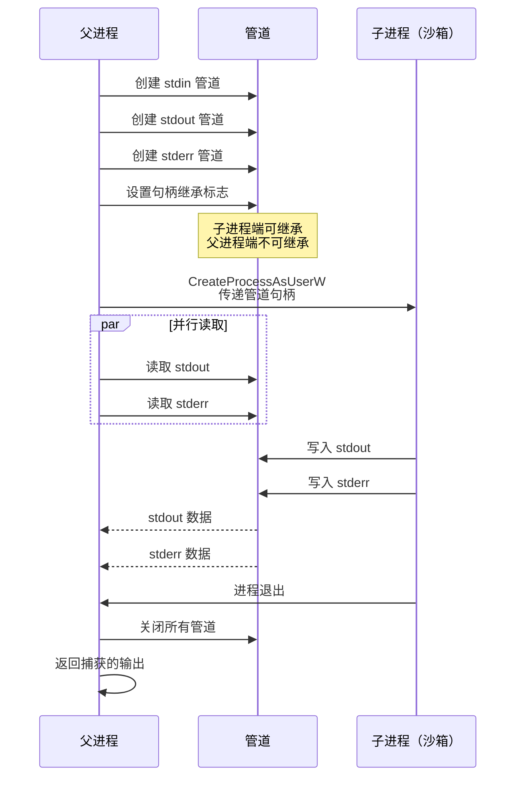
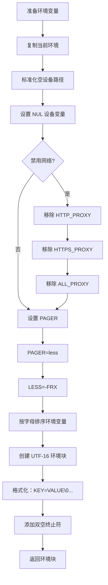
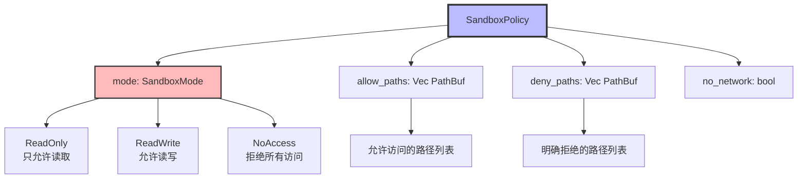
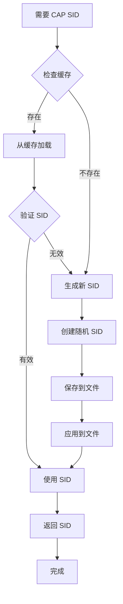
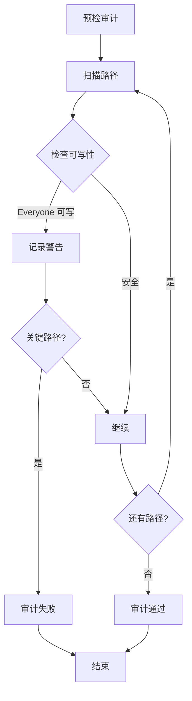
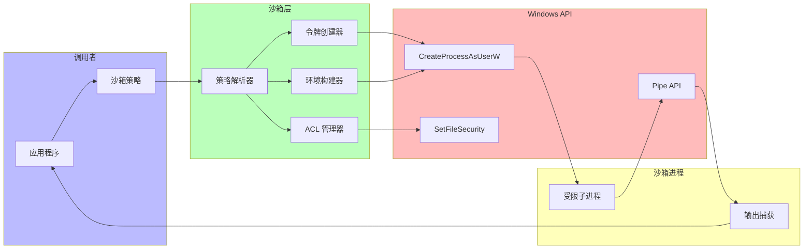

# windows-sandbox-rs 流程图

## 概述

`windows-sandbox-rs` crate 提供了 Windows 沙箱执行环境，使用 Windows 安全特性（如受限令牌、完整性级别、ACL 等）来隔离和限制进程权限。

## 1. 沙箱执行主流程



## 2. 受限令牌创建流程



## 3. ACL 权限管理流程



## 4. 管道和输出捕获流程



## 5. 环境变量处理流程



## 6. 沙箱策略类型



## 7. CAP SID 管理流程



## 8. 审计流程



## 9. 数据流图



## 10. 错误处理流程

```mermaid
flowchart TD
    Start[检测错误] --> ClassifyError{错误类型}

    ClassifyError -->|创建令牌失败| LogTokenError[记录令牌错误]
    ClassifyError -->|ACL 操作失败| LogACLError[记录 ACL 错误]
    ClassifyError -->|进程创建失败| LogProcessError[记录进程创建错误]
    ClassifyError -->|其他| LogGenericError[记录通用错误]

    LogTokenError --> Cleanup[清理资源]
    LogACLError --> Cleanup
    LogProcessError --> Cleanup
    LogGenericError --> Cleanup

    Cleanup --> CloseHandles[关闭句柄]
    CloseHandles --> RestoreACLs[恢复 ACL]
    RestoreACLs --> FormatError[格式化错误消息]

    FormatError --> GetLastError[获取 GetLastError()]
    GetLastError --> ReturnError[返回错误]
```

## 关键决策点

1. **平台检查**：仅在 Windows 上启用，其他平台返回不支持
2. **沙箱模式**：根据策略决定文件访问权限级别
3. **网络限制**：可选择性禁用网络访问
4. **ACL 保护**：在操作前备份原始 ACL，失败时恢复
5. **审计门槛**：检测高风险配置并可选择性失败

## Windows 安全机制

### 1. 受限令牌（Restricted Token）
- 移除管理员特权
- 限制可访问的 SID
- 降低完整性级别

### 2. 完整性级别（Integrity Level）
- **Low**: 沙箱进程使用低完整性级别
- 无法访问高完整性级别的资源
- 符合 Windows UAC 和 UIPI 机制

### 3. ACL（访问控制列表）
- 控制文件和目录访问
- 使用 CAP SID 标识沙箱进程
- 支持读、写、执行权限

### 4. 能力 SID（Capability SID）
- 唯一标识沙箱会话
- 用于 ACL 规则
- 持久化以支持多次执行

## 安全特性

1. **最小权限原则**：只授予必要的权限
2. **默认拒绝**：除非明确允许，否则拒绝访问
3. **审计日志**：记录所有安全操作
4. **清理保证**：确保退出时恢复原始状态
5. **错误处理**：失败时安全地清理资源

## 性能考虑

1. **SID 缓存**：重用 CAP SID 避免重复生成
2. **ACL 批量操作**：减少系统调用次数
3. **异步输出捕获**：并行读取 stdout 和 stderr
4. **环境变量预处理**：一次性构建环境块

## 限制和注意事项

1. **仅限 Windows**：不支持其他操作系统
2. **权限要求**：需要足够权限来操作令牌和 ACL
3. **性能开销**：安全检查会增加启动时间
4. **兼容性**：依赖 Windows Vista 及以上版本的 API
