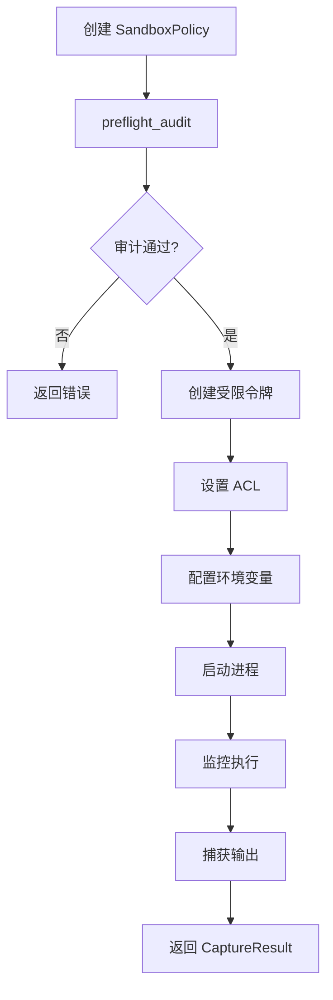

# windows-sandbox-rs

## 文件在整体的作用

`codex-windows-sandbox` 实现 Windows 特定的沙箱功能，用于在隔离环境中安全执行代码。它使用 Windows API 创建受限的进程环境，限制文件系统访问、网络访问和其他系统资源。

## 平台支持

### Windows
- 完整实现，使用 Windows Security API
- 支持多种沙箱模式

### 其他平台（Linux、macOS）
- 提供 stub 实现
- 编译时条件排除（`#[cfg(target_os = "windows")]`）

## 主要结构体

### `SandboxPolicy`
```rust
pub struct SandboxPolicy {
    pub mode: SandboxMode,
    pub allowed_paths: Vec<PathBuf>,
    pub denied_paths: Vec<PathBuf>,
    pub allow_network: bool,
}
```
- 沙箱策略配置

### `SandboxMode` (enum)
```rust
pub enum SandboxMode {
    None,           // 无沙箱
    LowIntegrity,   // 低完整性级别
    Restricted,     // 受限令牌
    AppContainer,   // AppContainer（最严格）
}
```
- 沙箱模式级别

### `CaptureResult`
```rust
pub struct CaptureResult {
    pub stdout: Vec<u8>,
    pub stderr: Vec<u8>,
    pub exit_code: i32,
    pub duration_ms: u64,
}
```
- 命令执行结果

## 主要模块

### acl.rs - 访问控制列表
- 管理文件和目录的 ACL
- 限制进程访问权限

### allow.rs - 允许路径
- 计算允许访问的路径列表
- 处理路径通配符

### audit.rs - 审计日志
- 记录沙箱操作
- 检测可疑行为

### cap.rs - 能力管理
- Windows 能力（Capabilities）管理
- 限制特权操作

### env.rs - 环境变量
- 设置沙箱环境变量
- 清理敏感信息

### logging.rs - 日志
- 沙箱事件日志
- 调试信息

### policy.rs - 策略应用
- 应用沙箱策略到进程
- 策略验证

### process.rs - 进程管理
- 创建受限进程
- 进程监控

### token.rs - 令牌处理
- 创建受限访问令牌
- 移除特权

### winutil.rs - Windows 工具
- Windows API 包装
- 错误处理

## 主要函数

### `run_windows_sandbox_capture(command, args, policy) -> Result<CaptureResult>`
- 在沙箱中运行命令并捕获输出
- **参数**：
  - `command`: 要执行的命令
  - `args`: 命令参数
  - `policy`: 沙箱策略
- **返回**：执行结果

### `preflight_audit_everyone_writable(cwd) -> Result<()>`
- 预检审计：检查工作目录是否允许所有人写入
- 防止权限提升

## 沙箱模式详解

### None
```rust
SandboxMode::None
```
- 不应用沙箱
- 正常执行
- 用于调试

### LowIntegrity
```rust
SandboxMode::LowIntegrity
```
- 设置进程为低完整性级别
- 限制写入高完整性文件
- 适用于不可信输入处理

### Restricted
```rust
SandboxMode::Restricted
```
- 使用受限令牌
- 移除管理员特权
- 限制系统调用

### AppContainer
```rust
SandboxMode::AppContainer
```
- 最严格的沙箱
- 应用容器隔离
- 限制网络、文件系统、注册表访问
- 类似于 UWP 应用沙箱

## 使用示例

### 基本用法
```rust
use codex_windows_sandbox::*;

let policy = SandboxPolicy {
    mode: SandboxMode::Restricted,
    allowed_paths: vec![PathBuf::from("C:\\Work")],
    denied_paths: vec![PathBuf::from("C:\\Windows")],
    allow_network: false,
};

let result = run_windows_sandbox_capture(
    "cmd.exe",
    &["/c", "dir"],
    &policy,
)?;

println!("输出: {}", String::from_utf8_lossy(&result.stdout));
println!("退出码: {}", result.exit_code);
```

### 严格沙箱
```rust
let policy = SandboxPolicy {
    mode: SandboxMode::AppContainer,
    allowed_paths: vec![
        PathBuf::from("C:\\Project\\src"),
    ],
    denied_paths: vec![],
    allow_network: false,
};

let result = run_windows_sandbox_capture(
    "python",
    &["script.py"],
    &policy,
)?;
```

## 安全特性

### 文件系统隔离
- ✅ 只允许访问指定路径
- ✅ 禁止访问系统目录
- ✅ 阻止路径遍历攻击

### 网络隔离
- ✅ 可选禁用网络访问
- ✅ 防止数据泄露

### 特权移除
- ✅ 移除管理员权限
- ✅ 降低进程完整性级别
- ✅ 限制系统调用

### 审计
- ✅ 记录所有文件访问
- ✅ 监控可疑行为
- ✅ 生成审计日志

## 工作流程



## 依赖关系

- `windows-sys`: Windows API 绑定
- `anyhow`: 错误处理
- 条件编译：仅在 Windows 上编译

## 在项目中的位置

```
┌──────────────────────────┐
│  codex-core              │
│  (调用沙箱)              │
└──────────┬───────────────┘
           │ (Windows)
┌──────────▼───────────────┐
│  windows-sandbox-rs      │ ← 此 crate
└──────────┬───────────────┘
           │
┌──────────▼───────────────┐
│  Windows Security API    │
└──────────────────────────┘
```

## 限制和注意事项

### 仅 Windows
- 此 crate 仅在 Windows 上有效
- Linux 使用 Landlock
- macOS 使用 Seatbelt

### 需要权限
- 某些沙箱模式需要特定权限
- AppContainer 需要 Windows 8+

### 性能开销
- 沙箱启动有开销（~100ms）
- ACL 设置需要时间
- 适合中长期任务

## 调试

### 启用日志
```rust
env::set_var("WINDOWS_SANDBOX_DEBUG", "1");
```

### 审计日志位置
```
%TEMP%\codex_sandbox_audit.log
```

## Stub 实现（非 Windows）

在 Linux 和 macOS 上：
```rust
pub fn run_windows_sandbox_capture(
    _command: &str,
    _args: &[&str],
    _policy: &SandboxPolicy,
) -> Result<CaptureResult> {
    Err(anyhow!("Windows sandbox not supported on this platform"))
}
```
