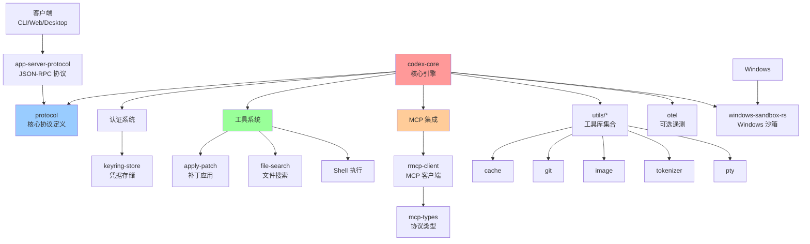
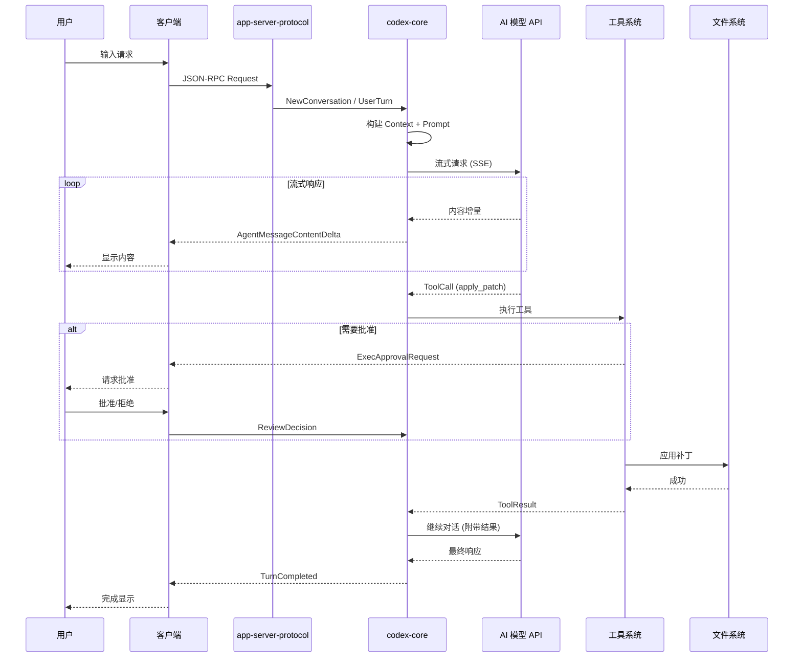
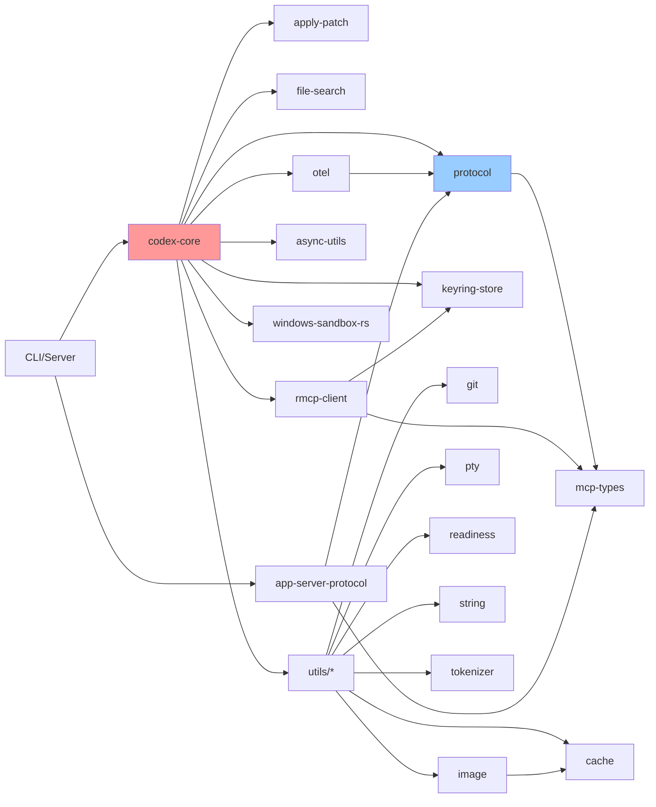
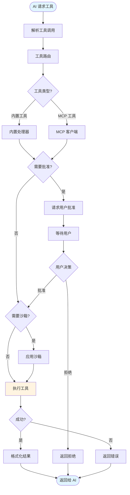
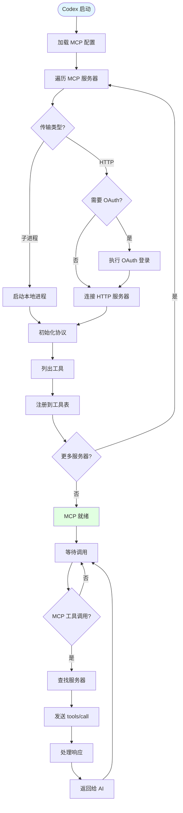
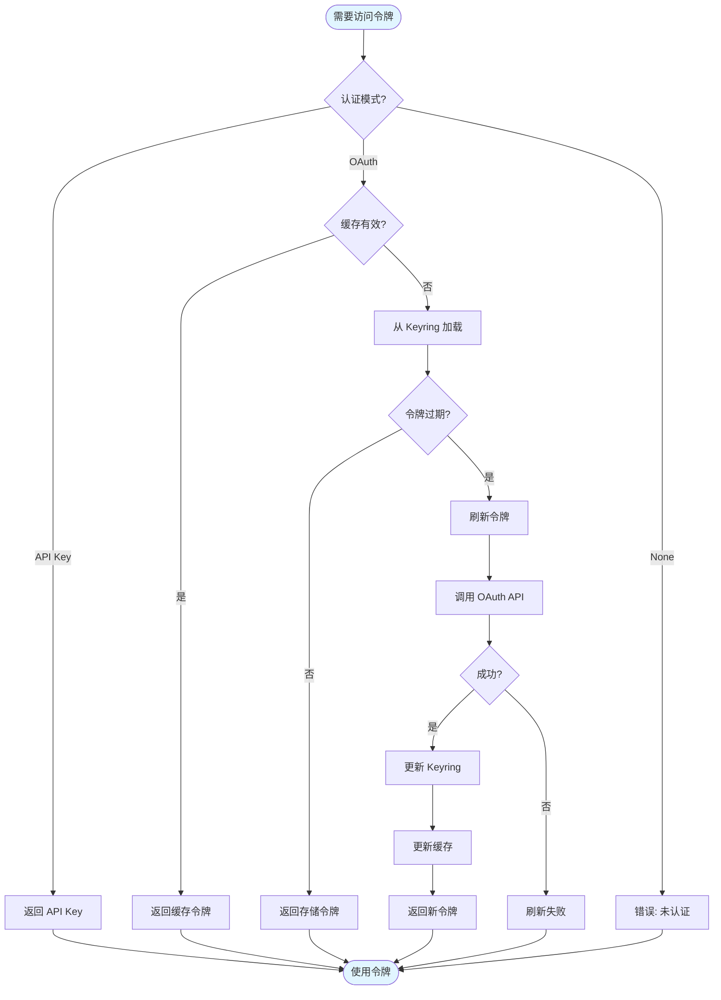
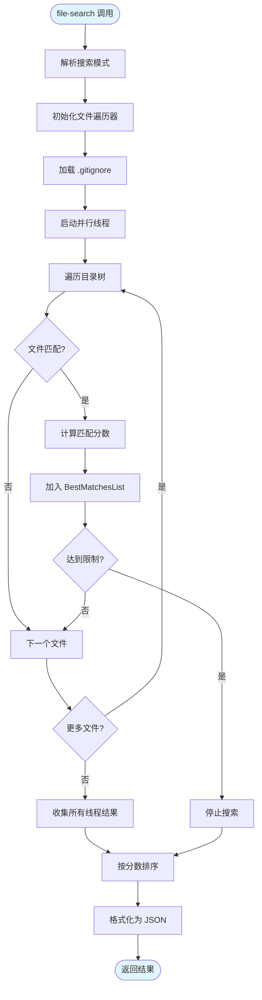
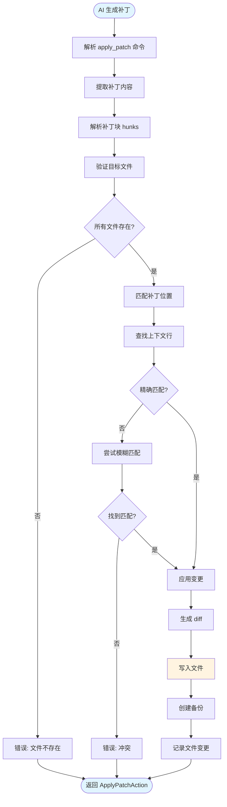
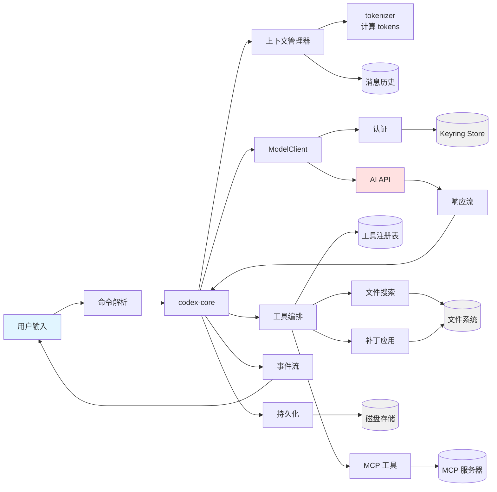
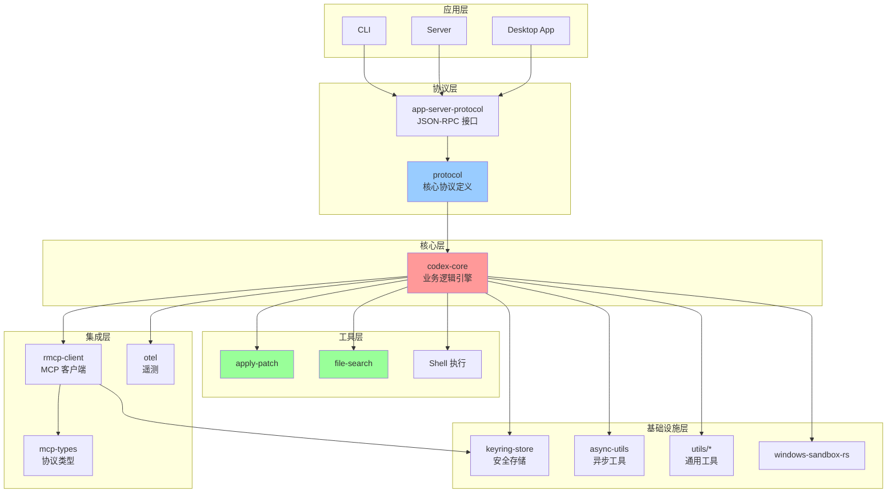

# Codex 项目整体运行机制流程图

## 1. 项目整体架构

## 2. 完整用户交互流程

## 3. Crate 依赖关系图

## 4. 工具执行流程

## 5. MCP 集成流程

## 6. 认证流程

## 7. 文件搜索流程

## 8. 补丁应用流程

## 9. 数据流图

## 10. 项目分层架构

## 流程图说明

### 图 1: 项目整体架构
展示所有 crate 及其依赖关系。

### 图 2: 完整用户交互流程
从用户输入到完成的完整序列。

### 图 3: Crate 依赖关系图
详细的依赖关系和导入路径。

### 图 4: 工具执行流程
工具调用的决策和执行流程。

### 图 5: MCP 集成流程
MCP 服务器连接和工具调用。

### 图 6: 认证流程
OAuth 和 API Key 认证的完整流程。

### 图 7: 文件搜索流程
file-search 的并行搜索算法。

### 图 8: 补丁应用流程
apply-patch 的解析和应用流程。

### 图 9: 数据流图
数据在各组件间的流动。

### 图 10: 项目分层架构
按功能分层的架构视图。
